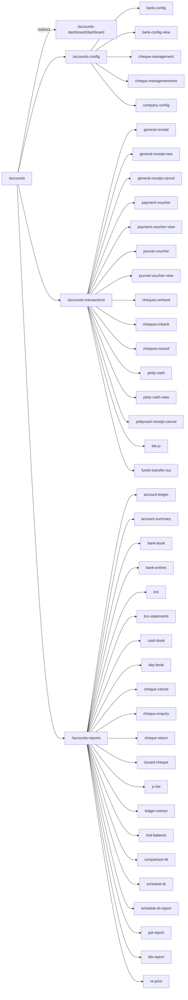
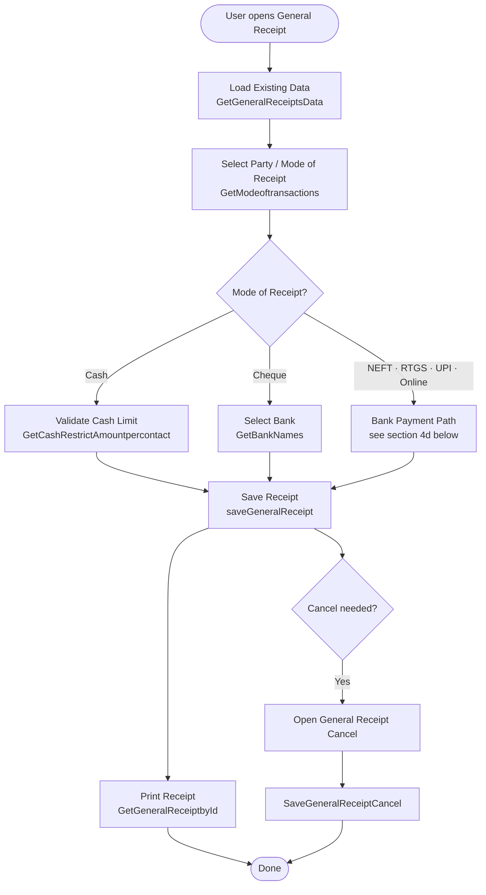
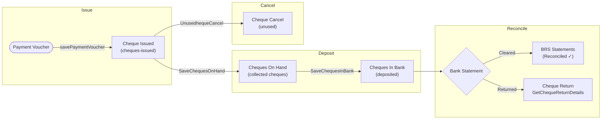
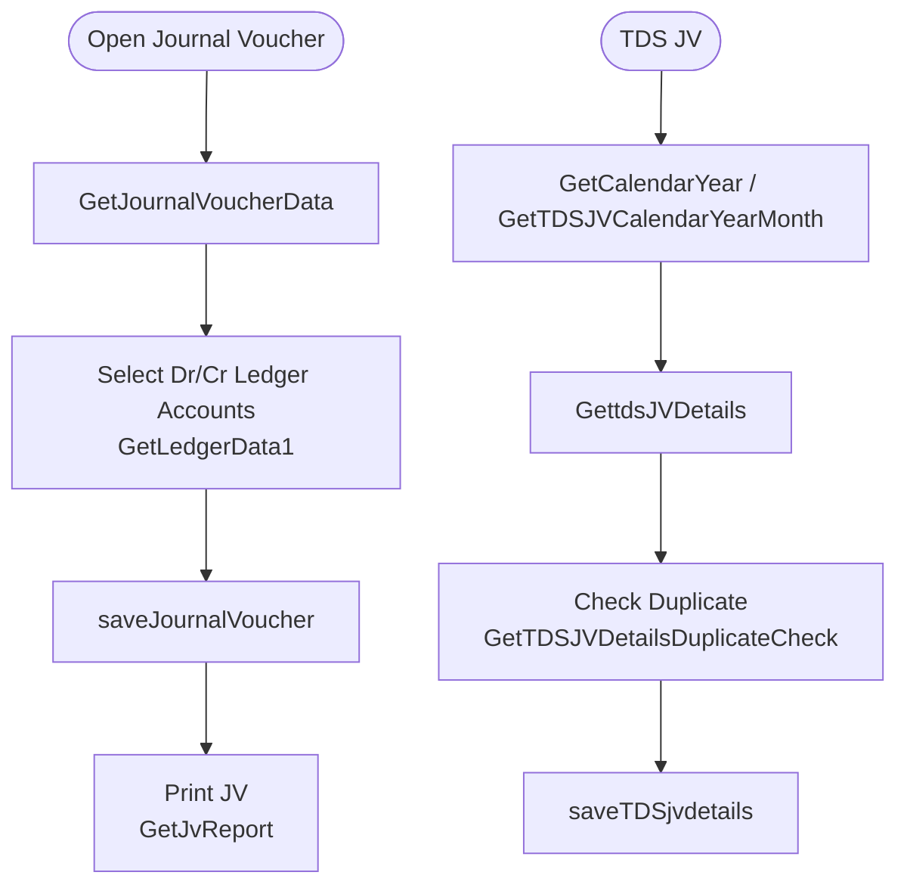
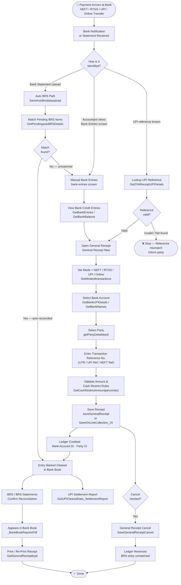
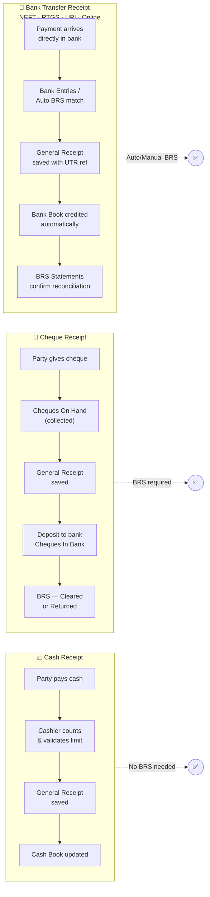
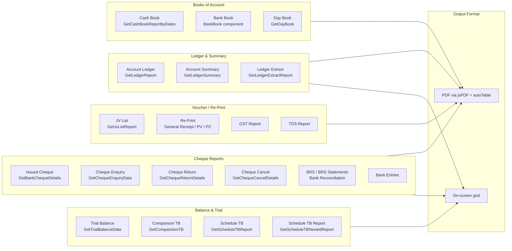
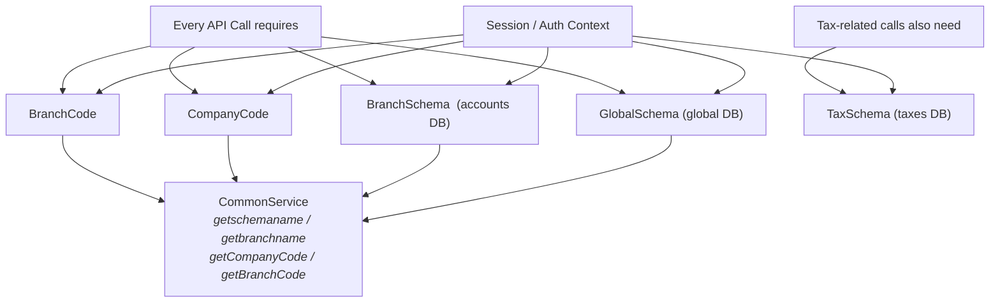

# Accounts Module — Overview

> Angular standalone components · Lazy-loaded routes · Three service classes

---

## 1. Top-Level Structure

```mermaid
graph TD
    ACCOUNTS["🏦 Accounts Module<br/><i>features/accounts/</i>"]

    ACCOUNTS --> CFG["⚙️ Accounts Config<br/><i>Accounts_Config/</i>"]
    ACCOUNTS --> TXN["📝 Accounts Transactions<br/><i>Accounts_Transactions/</i>"]
    ACCOUNTS --> RPT["📊 Accounts Reports<br/><i>Accounts_Reports/</i>"]
    ACCOUNTS --> DSH["🏠 Dashboard<br/><i>accounts-dashboard/</i>"]

    CFG --> C1["Bank Config"]
    CFG --> C2["Bank Config View"]
    CFG --> C3["Cheque Management"]
    CFG --> C4["Company Config"]

    TXN --> T1["General Receipt"]
    TXN --> T2["General Receipt New"]
    TXN --> T3["General Receipt Cancel"]
    TXN --> T4["Payment Voucher"]
    TXN --> T5["Payment Voucher View"]
    TXN --> T6["Journal Voucher"]
    TXN --> T7["Journal Voucher View"]
    TXN --> T8["Cheques On Hand"]
    TXN --> T9["Cheques In Bank"]
    TXN --> T10["Cheques Issued"]
    TXN --> T11["Petty Cash"]
    TXN --> T12["Petty Cash View"]
    TXN --> T13["Petty Cash Cancel"]
    TXN --> T14["TDS JV"]
    TXN --> T15["Funds Transfer Out"]

    RPT --> R1["Account Ledger"]
    RPT --> R2["Account Summary"]
    RPT --> R3["Bank Book"]
    RPT --> R4["Bank Entries"]
    RPT --> R5["BRS / BRS Statements"]
    RPT --> R6["Cash Book"]
    RPT --> R7["Day Book"]
    RPT --> R8["Cheque Enquiry"]
    RPT --> R9["Cheque Cancel"]
    RPT --> R10["Cheque Return"]
    RPT --> R11["Issued Cheque"]
    RPT --> R12["JV List"]
    RPT --> R13["Ledger Extract"]
    RPT --> R14["Trial Balance"]
    RPT --> R15["Comparison TB"]
    RPT --> R16["Schedule TB / Report"]
    RPT --> R17["GST Report"]
    RPT --> R18["TDS Report"]
    RPT --> R19["Re-Print"]
    RPT --> R20["General Receipt<br/>(Report View)"]
    RPT --> R21["Payment Voucher<br/>(Report View)"]
    RPT --> R22["Journal Voucher<br/>(Report View)"]
```

---

## 2. Route Map

---

## 3. Service Layer

```mermaid
graph TD
    SVC["Angular Services<br/><i>core/services/accounts/</i>"]

    SVC --> CS["AccountsConfig<br/><i>accounts-config.ts</i>"]
    SVC --> TS["AccountsTransactions<br/><i>accounts-transactions.ts</i>"]
    SVC --> RS["AccountsReports<br/><i>accounts-reports.ts</i>"]

    CS --> CS1["GetBankDetails / GetBankNames"]
    CS --> CS2["GetBankUPIDetails"]
    CS --> CS3["SaveBankInformation / viewbank"]
    CS --> CS4["GetChequeManagement / SaveChequeManagement"]
    CS --> CS5["GetAccountTree / GetAccountTreeSearch"]
    CS --> CS6["SaveAccountHeads"]
    CS --> CS7["GetSubLedgerdata"]
    CS --> CS8["SaveCompanyConfiguration"]
    CS --> CS9["GetCompanyBranchHierarchy"]

    TS --> TS1["GetGeneralReceiptsData / saveGeneralReceipt"]
    TS --> TS2["GetPaymentVoucherExistingData / savePaymentVoucher"]
    TS --> TS3["GetJournalVoucherData / saveJournalVoucher"]
    TS --> TS4["GetChequesOnHandData / SaveChequesOnHand"]
    TS --> TS5["GetChequesInBankData / SaveChequesInBank"]
    TS --> TS6["GetChequesIssued / SaveChequesIssued"]
    TS --> TS7["GetPettyCashExistingData / SavePettyCash"]
    TS --> TS8["savepettycashcancel / SaveGeneralReceiptCancel"]
    TS --> TS9["GettdsJVDetails / saveTDSjvdetails"]
    TS --> TS10["GetBankBalance / GetCashonhandBalance"]
    TS --> TS11["GetSubLedgerData / GetLedgerData1"]
    TS --> TS12["SaveBankTransferDetails / GetBankTransferTypes"]

    RS --> RS1["GetLedgerReport (Account Ledger)"]
    RS --> RS2["GetCashBookReportbyDates (Cash Book)"]
    RS --> RS3["GetDayBook (Day Book)"]
    RS --> RS4["GetLedgerSummary (Account Summary)"]
    RS --> RS5["GetTrialBalanceData (Trial Balance)"]
    RS --> RS6["GetComparisionTB (Comparison TB)"]
    RS --> RS7["GetJvListReport / GetJvListReportGroup"]
    RS --> RS8["GetGeneralReceiptbyId / GetPaymentVoucherbyId"]
    RS --> RS9["GetJvReport (JV Report)"]
    RS --> RS10["GetScheduleTBReport / GetScheduleTBNestedReport"]
    RS --> RS11["_CashBookReportsPdf / _BankBookReportsPdf (PDF gen)"]
```

---

## 4. Transaction Flows

### 4a. General Receipt Flow — All Modes

### 4b. Cheque Lifecycle

### 4c. Journal Voucher & TDS Flow

### 4d. General Receipt — Bank Process Flow (NEFT · RTGS · UPI · Online)

> This flow is introduced when payment is **received directly into the bank account** — not by physical cash or cheque hand-over.

#### Bank Payment — Key API Reference

| Step | Screen | API Method | Purpose |
|---|---|---|---|
| Identify payment | Bank Entries | `GetBankEntries` | View inbound credits |
| UPI validation | General Receipt | `GetChitReceiptUPIDetails` | Verify UPI reference |
| Bank selection | General Receipt | `GetBankUPIDetails` / `GetBankNames` | Load bank accounts |
| UPI bank list | General Receipt | `GetPayTmBanksList` | UPI-enabled banks |
| Party lookup | General Receipt | `getPartyDetailsbyid` | Fetch party ledger |
| Save (regular) | General Receipt | `saveGeneralReceipt` | Post receipt entry |
| Save (online JV) | General Receipt | `SaveOnLineCollection_JV` | Online collection as JV |
| Auto BRS match | BRS Statements | `GetPendingautoBRSDetails` | Pending BRS items |
| Auto BRS upload | BRS Statements | `SaveAutoBrsdataupload` | Upload bank statement |
| Balance check | Bank Book | `GetBankBalance` | Verify bank balance |
| Settlement | Bank Entries | `GetUPIClearedData_SettlementReport` | UPI cleared summary |
| Reconciliation | BRS Statements | `DataFromBrsDatesChequesInBank` | Cleared entries |
| Print receipt | Re-Print | `GetGeneralReceiptbyId` | Receipt document |

#### Comparison: Cash vs Cheque vs Bank Payment

---

## 5. Reports & Output

---

## 6. Key Data Context

---

## Summary Table

| Sub-Module | Screens | Service Class | Key Operations |
|---|---|---|---|
| **Config** | 4 | `AccountsConfig` | Bank setup, Cheque books, Account Tree, Company config |
| **Transactions** | 15 | `AccountsTransactions` | Receipts, Payments, JVs, Cheque lifecycle, Petty Cash, TDS |
| **Reports** | 22 | `AccountsReports` | Ledger, Cash/Bank Book, Trial Balance, BRS, Cheque reports, PDF export |
| **Dashboard** | 1 | — | Summary view |

> All components are **standalone** and **lazy-loaded**. Routes are defined in [accounts_routs.ts](src/app/features/accounts/accounts_routs.ts). Services are `providedIn: 'root'` and shared via `CommonService` for schema/auth context.
