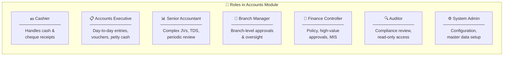
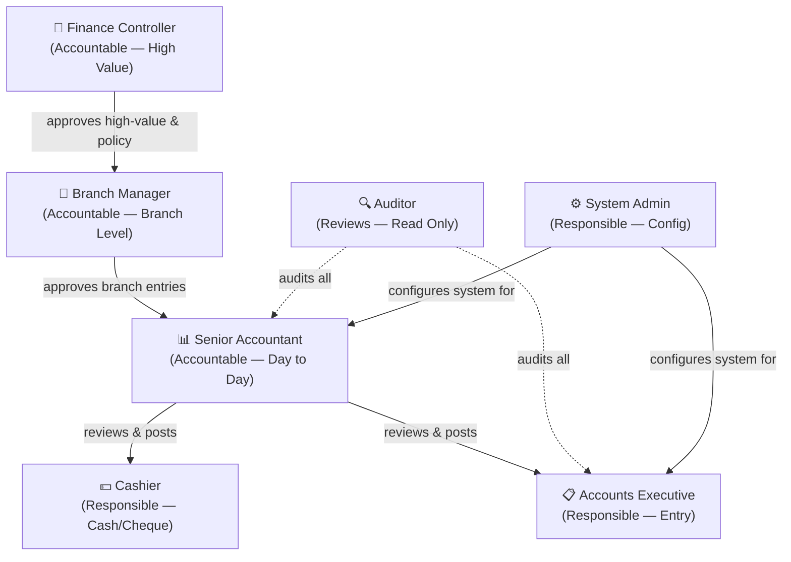
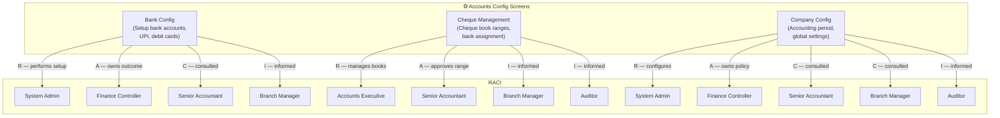
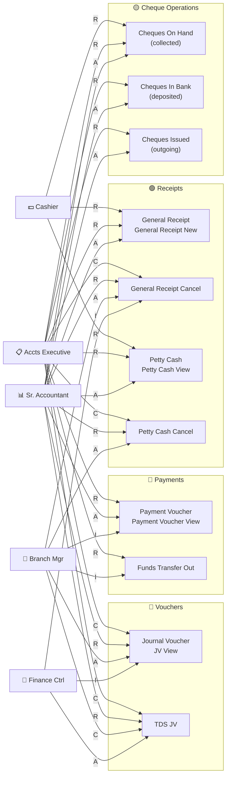
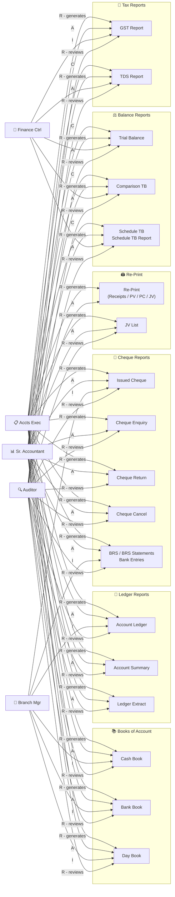
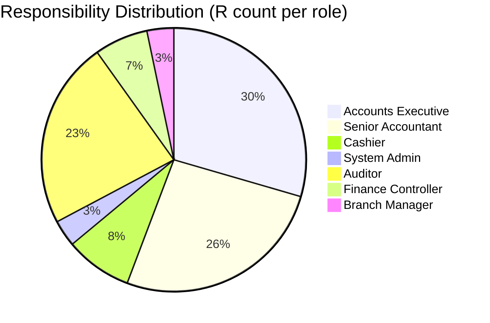
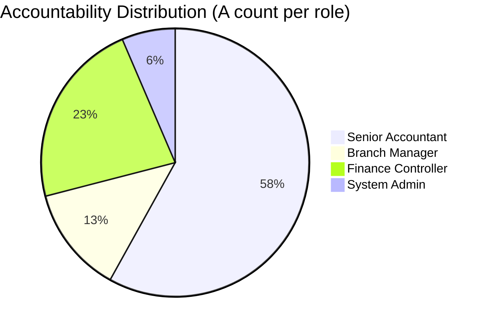
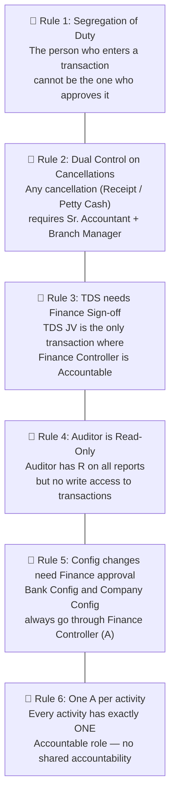

# Accounts Module — RACI Diagram

> **R** = Responsible (does the work) &nbsp;|&nbsp; **A** = Accountable (owns the outcome) &nbsp;|&nbsp; **C** = Consulted (input before) &nbsp;|&nbsp; **I** = Informed (notified after)

---

## 1. Roles & Definitions

---

## 2. Approval Hierarchy

---

## 3. Configuration — RACI

---

## 4. Transactions — RACI Matrix

---

## 5. Reports — RACI Matrix

---

## 6. Full RACI Matrix (Reference Table)

### 6a. Configuration

| Screen / Activity | Cashier | Accts Executive | Sr. Accountant | Branch Manager | Finance Controller | System Admin | Auditor |
|---|:---:|:---:|:---:|:---:|:---:|:---:|:---:|
| Bank Config Setup | — | C | C | I | **A** | **R** | I |
| Cheque Book Management | — | **R** | **A** | I | I | — | I |
| Company Configuration | — | — | C | C | **A** | **R** | I |

### 6b. Transactions

| Screen / Activity | Cashier | Accts Executive | Sr. Accountant | Branch Manager | Finance Controller | System Admin | Auditor |
|---|:---:|:---:|:---:|:---:|:---:|:---:|:---:|
| General Receipt Entry | **R** | **R** | **A** | I | I | — | I |
| General Receipt Cancel | — | C | **R** | **A** | I | — | I |
| Payment Voucher | — | **R** | **A** | I | I | — | I |
| Funds Transfer Out | — | **R** | **A** | C | I | — | I |
| Journal Voucher | — | C | **R** | **A** | I | — | I |
| TDS JV | — | C | **R** | C | **A** | — | I |
| Cheques On Hand | **R** | **R** | **A** | I | I | — | I |
| Cheques In Bank | — | **R** | **A** | I | I | — | I |
| Cheques Issued | — | **R** | **A** | I | I | — | I |
| Petty Cash Entry | **R** | **R** | **A** | I | I | — | I |
| Petty Cash Cancel | — | C | **R** | **A** | I | — | I |

### 6c. Reports

| Report | Cashier | Accts Executive | Sr. Accountant | Branch Manager | Finance Controller | Auditor |
|---|:---:|:---:|:---:|:---:|:---:|:---:|
| Account Ledger | I | **R** | **A** | I | I | **R** |
| Account Summary | — | **R** | **A** | I | I | **R** |
| Ledger Extract | — | **R** | **A** | I | I | **R** |
| Cash Book | I | **R** | **A** | I | I | **R** |
| Bank Book | — | **R** | **A** | I | I | **R** |
| Day Book | I | **R** | **A** | I | I | **R** |
| Trial Balance | — | C | **R** | I | **A** | **R** |
| Comparison TB | — | C | **R** | I | **A** | **R** |
| Schedule TB / Report | — | C | **R** | I | **A** | **R** |
| BRS / BRS Statements | — | **R** | **A** | I | I | **R** |
| Bank Entries | — | **R** | **A** | I | I | **R** |
| Issued Cheque | I | **R** | **A** | I | I | **R** |
| Cheque Enquiry | I | **R** | **A** | I | I | **R** |
| Cheque Return | — | **R** | **A** | I | I | **R** |
| Cheque Cancel | — | **R** | **A** | I | I | **R** |
| GST Report | — | **R** | **A** | C | I | **R** |
| TDS Report | — | C | **R** | C | **A** | **R** |
| JV List | — | **R** | **A** | I | I | **R** |
| Re-Print | I | **R** | **A** | I | I | — |

---

## 7. RACI Summary by Role

---

## 8. Key Rules

