# ERP Architecture Document

Project: Global ERP V21  
Application type: SaaS-based ERP frontend with REST API backend  
Document purpose: Provide a shared technical and business architecture reference for developers, business analysts, project managers, QA teams, and stakeholders.

## 1. Project Overview

Global ERP V21 is an Angular-based enterprise resource planning application. The current repository contains the frontend application and integrates with a remote REST API backend.

The application is organized around ERP business modules such as Accounts, Inventory, HRMS, Reports, Settings, Dashboard, and support workflows. The UI supports company and branch context selection during login, and most business operations use that selected context through browser session storage and shared services.

### Key Observations From The Codebase

| Area | Observation |
| --- | --- |
| Frontend framework | Angular 21 application using standalone components and route-level lazy loading |
| Application shell | `MainLayoutComponent` protects authenticated dashboard routes |
| API base URL | Loaded from environment and `src/assets/appsettings.json`; current configured API is `https://globalacc-api.kapilit.com/api` |
| Authentication | Login API stores user, token, company, branch, and branch ID in `sessionStorage` |
| Route protection | `authGuard` checks whether a token exists; `guestGuard` redirects authenticated users away from login |
| Module navigation | `NavigationService` maintains module, submodule, screen, dashboard, and user-rights state |
| Reporting | Inventory and HRMS reports use configurable report shells with Excel, PDF, and print support |
| Backend source | Backend code is not present in this repository; backend architecture below is inferred from frontend API usage and ERP requirements |
| Database source | Physical database schema is not present in this repository; database architecture below is logical and inferred |

## 2. Technology Stack

| Layer | Technology / Library | Purpose |
| --- | --- | --- |
| Frontend framework | Angular 21 | Single page application, routing, components, forms |
| Language | TypeScript 5.9 | Application logic and typed models |
| Build system | `@angular/build:application` | Production and development builds |
| UI framework | Bootstrap 5 | Layout and responsive UI |
| UI components | PrimeNG 21, PrimeIcons, ngx-bootstrap, ng-select | Tables, inputs, modals, icons, selects, widgets |
| State pattern | Angular services with `BehaviorSubject` and browser storage | Shared module, user, company, branch, and navigation state |
| HTTP | Angular `HttpClient` | REST API communication |
| Reporting exports | jsPDF, jspdf-autotable, xlsx, file-saver | PDF, Excel, and downloadable report output |
| Notifications | ngx-toastr, PrimeNG MessageService | UI feedback and messages |
| Email support | EmailJS browser SDK | SOS ticket email fallback |
| Runtime config | `src/assets/appsettings.json` and Angular environments | API host configuration |
| Styling | SCSS, Bootstrap CSS, ng-select theme | Application styling |

## 3. High-Level System Architecture

The application follows a browser-based SPA architecture. Users interact with Angular screens, which call feature services and shared services. These services call the backend REST API. The backend is expected to enforce business rules, tenant isolation, authorization, approval workflows, posting logic, and database transactions.

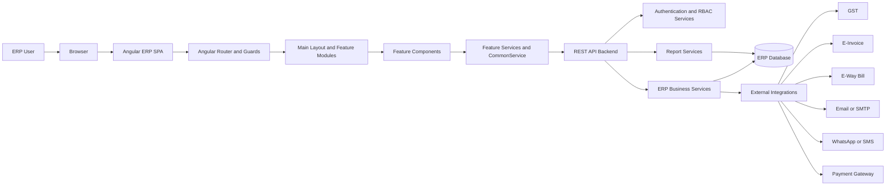
```mermaid
flowchart LR
    User[ERP User] --> Browser[Browser]
    Browser --> SPA[Angular ERP SPA]
    SPA --> Router[Angular Router and Guards]
    Router --> Layout[Main Layout and Feature Modules]
    Layout --> Components[Feature Components]
    Components --> Services[Feature Services and CommonService]
    Services --> API[REST API Backend]
    API --> Auth[Authentication and RBAC Services]
    API --> Business[ERP Business Services]
    API --> Reports[Report Services]
    Business --> DB[(ERP Database)]
    Reports --> DB
    Business --> Integrations[External Integrations]
    Integrations --> GST[GST]
    Integrations --> EINVOICE[E-Invoice]
    Integrations --> EWAY[E-Way Bill]
    Integrations --> Email[Email or SMTP]
    Integrations --> WhatsApp[WhatsApp or SMS]
    Integrations --> Payments[Payment Gateway]
```

### Main Runtime Flow

1. User opens the Angular application.
2. Login screen loads API host and company list.
3. User selects company and branch.
4. Login API validates credentials and returns user context.
5. Frontend stores session context in `sessionStorage`.
6. Authenticated routes load dashboard and ERP modules.
7. Components call backend APIs through domain services or `CommonService`.
8. Backend validates tenant, role, approval, and transaction rules.
9. Database writes are committed and reports are generated from transactional and summarized data.

## 4. Frontend Architecture

The frontend is organized into core services, shared utilities, feature modules, route files, and standalone components.

### Frontend Structure

| Folder / File | Responsibility |
| --- | --- |
| `src/app/app.routes.ts` | Root routing, login route, dashboard layout route, printable voucher routes |
| `src/app/app.config.ts` | Angular providers such as router, HTTP client, animations, messages, date pipe |
| `src/app/core/guards/auth.guard.ts` | Authenticated and guest route guards |
| `src/app/core/services/auth.service.ts` | Session setup, token check, logout, current user state |
| `src/app/core/services/common.service.ts` | Shared API calls, company and branch context, utility functions, report/export helpers |
| `src/app/core/services/navigation.service.ts` | Module metadata, user rights retrieval, active module/submodule/screen state |
| `src/app/features/accounts` | Accounts dashboard, transactions, reports, configuration |
| `src/app/features/inventory` | Inventory dashboard, masters, procurement, sales, stock, manufacturing, logistics, reports |
| `src/app/features/hrms` | HRMS dashboard, payroll, attendance, employee and statutory reports |
| `src/app/features/settings` | Settings dashboard and user-rights related flows |
| `src/app/shared` | Shared reusable components, services, layouts, and utilities |

### Frontend Route Architecture

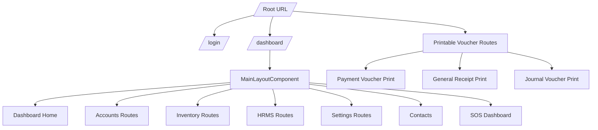
```mermaid
flowchart TD
    Root[/Root URL/] --> Login[/login/]
    Root --> Dashboard[/dashboard/]
    Dashboard --> MainLayout[MainLayoutComponent]
    MainLayout --> DashboardHome[Dashboard Home]
    MainLayout --> Accounts[Accounts Routes]
    MainLayout --> Inventory[Inventory Routes]
    MainLayout --> HRMS[HRMS Routes]
    MainLayout --> Settings[Settings Routes]
    MainLayout --> Contacts[Contacts]
    MainLayout --> SOS[SOS Dashboard]
    Root --> PrintRoutes[Printable Voucher Routes]
    PrintRoutes --> PaymentVoucher[Payment Voucher Print]
    PrintRoutes --> GeneralReceipt[General Receipt Print]
    PrintRoutes --> JournalVoucher[Journal Voucher Print]
```

### Frontend State Model

| State | Storage / Owner | Purpose |
| --- | --- | --- |
| Token | `sessionStorage.token` via `AuthService` | Indicates authenticated session |
| Login flag | `sessionStorage.isLoggedIn` | Quick session check |
| Username | `sessionStorage.username` | Display and audit context |
| User ID | `sessionStorage.userId` | Audit and report context |
| Company code | `sessionStorage.companyCode` | Tenant or company scope |
| Branch code | `sessionStorage.branchCode` | Branch scope |
| Branch ID | `sessionStorage.branchId` | Backend branch identifier |
| Company details | `sessionStorage.CompanyDetails` | Company/branch metadata for reports and transactions |
| API URL | `sessionStorage.apiURL` | Backend API base URL |
| Module selection | `NavigationService` BehaviorSubjects | Active module, submodule, screen, path, and dashboard state |

## 5. Backend Architecture

Backend code is not included in this frontend repository. The frontend communicates with a REST API hosted under the configured API base URL.

Current configured API host:

```text
https://globalacc-api.kapilit.com/api
```

The backend is expected to provide:

| Backend Capability | Purpose |
| --- | --- |
| Authentication APIs | Login, user validation, branch/company context loading |
| Authorization APIs | User rights based on role and user ID |
| Master data APIs | Company, branch, customer, vendor, product, bank, UOM, HSN/SAC, warehouse, payroll masters |
| Transaction APIs | Purchase, sales, inventory, accounts, payroll, vouchers, approvals |
| Reporting APIs | Ledger, GST, trial balance, inventory reports, payroll statutory reports |
| Notification APIs | Cheque alerts, subscriber balance alerts, support tickets |
| Integration APIs | GST, UPI, PayTm/Cashfree status, email, WhatsApp/SMS, e-invoice, e-way bill |

### Backend Layering Recommendation

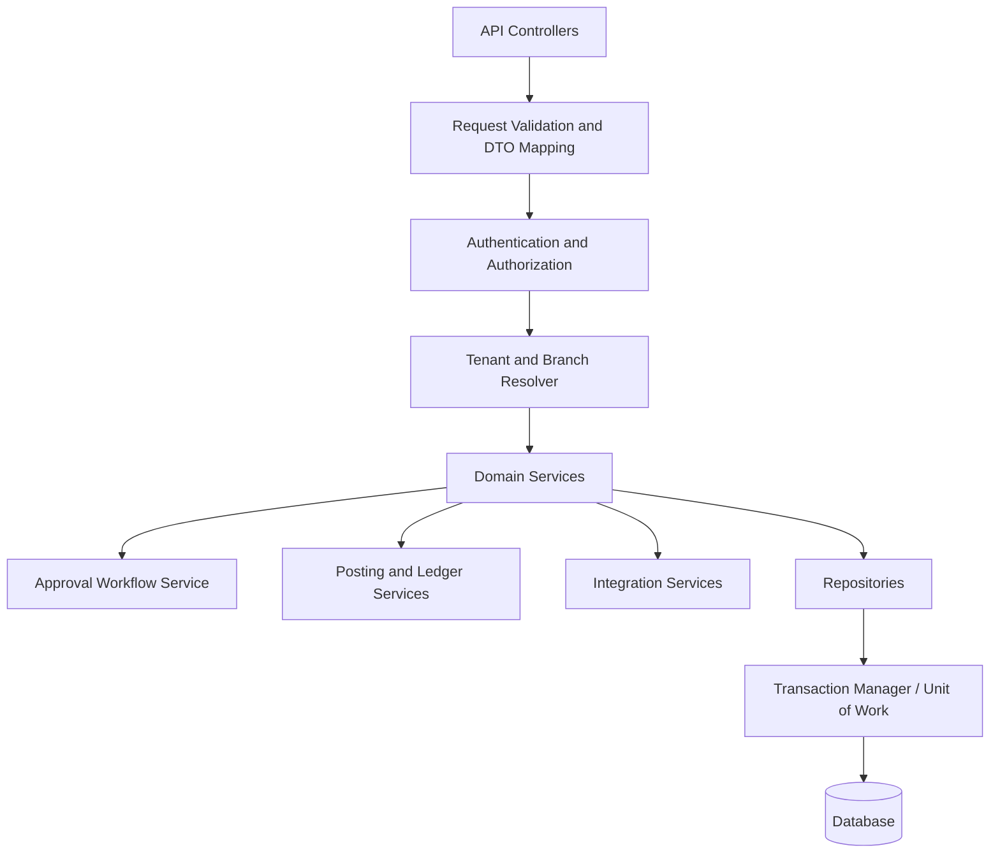
```mermaid
flowchart TD
    Controllers[API Controllers] --> RequestValidation[Request Validation and DTO Mapping]
    RequestValidation --> Authz[Authentication and Authorization]
    Authz --> TenantResolver[Tenant and Branch Resolver]
    TenantResolver --> Services[Domain Services]
    Services --> Approval[Approval Workflow Service]
    Services --> Posting[Posting and Ledger Services]
    Services --> Integration[Integration Services]
    Services --> Repositories[Repositories]
    Repositories --> UnitOfWork[Transaction Manager / Unit of Work]
    UnitOfWork --> Database[(Database)]
```

The frontend currently sends company, branch, user, schema, and role context in many API calls. The backend should not rely only on client-provided context. It should validate context against the authenticated token and user permissions.

## 6. Database Architecture

The database schema is not present in this repository. This section defines the logical database architecture that supports the frontend modules and observed API contracts.

### Logical Database Domains

| Domain | Example Tables / Entities | Purpose |
| --- | --- | --- |
| Tenant and company | Tenant, Company, Branch, FinancialYear | Multi-company and branch-level isolation |
| Security | User, Role, Permission, UserRole, RolePermission, UserBranchAccess | Authentication and RBAC |
| Global contact | GlobalContact, ContactRoleMap, ContactAddress, ContactKYC, ContactBank, ContactPerson | Single source for every person, customer, vendor, employee, approver, branch contact, and external party |
| Masters | Product, Category, UOM, HSN/SAC, Warehouse, Bank, Department, CustomerProfile, VendorProfile, EmployeeProfile | Shared ERP setup where party profiles reference Global Contact |
| Purchase | PurchaseRequisition, RFQ, PurchaseOrder, GoodsReceipt, PurchaseReturn | Procurement lifecycle |
| Inventory | StockLedger, StockTransfer, StockAdjustment, OpeningStock, Batch, SerialNumber | Inventory quantity and valuation |
| Sales | SalesEnquiry, SalesQuotation, SalesOrder, DeliveryChallan, SalesInvoice, SalesReturn | Order-to-cash lifecycle |
| Accounts | Ledger, Voucher, Receipt, Payment, Journal, Bank, Cheque, TrialBalance | Financial accounting |
| HRMS | Employee, Attendance, PayrollRun, SalaryComponent, Payslip, StatutoryContribution | HR and payroll |
| Reports | ReportDefinition, ReportSnapshot, ExportLog | Parameterized and generated reports |
| Audit | AuditLog, LoginHistory, ApprovalHistory, IntegrationLog | Traceability and compliance |

### Database Design Principles

1. Every transactional table should include tenant, company, branch, financial year, created by, created date, modified by, modified date, and status.
2. Header/detail structure should be used for purchase orders, goods receipts, sales invoices, vouchers, payroll runs, and stock transactions.
3. Stock movement should be recorded in a stock ledger table instead of only updating item balance.
4. Financial posting should be recorded through voucher header and voucher detail tables.
5. Approval state should be stored separately from transactional documents for traceability.
6. Report queries should read from transaction tables, summary tables, or materialized views depending on volume.

## 7. SaaS / Multi-Tenant Architecture

The application is moving toward a SaaS multi-tenant model. This model is not fully developed in the backend yet, but the login page already contains a simple Register / OTP demo process that captures identity, company setup, branch setup, and admin user setup. This planned registration path should become the tenant provisioning flow.

The current runtime login flow still uses company and branch selection. After login, the selected company and branch context is stored in the browser session and used by module APIs. The backend must become the authority for tenant, company, branch, schema, and permission resolution.

The current `CommonService` exposes schema-like context methods such as `getschemaname()` and `getbranchname()`. These currently return fixed values, so the future backend should resolve schema or tenant context from the authenticated tenant and user instead of trusting fixed frontend values.

### Planned Register Now Tenant Onboarding Flow

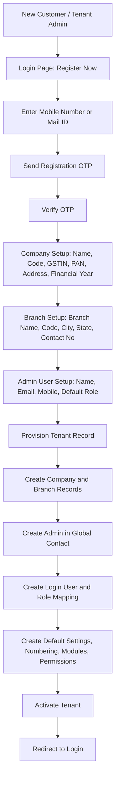
```mermaid
flowchart TD
    Visitor[New Customer / Tenant Admin] --> RegisterNow[Login Page: Register Now]
    RegisterNow --> Identity[Enter Mobile Number or Mail ID]
    Identity --> SendOTP[Send Registration OTP]
    SendOTP --> VerifyOTP[Verify OTP]
    VerifyOTP --> CompanySetup[Company Setup: Name, Code, GSTIN, PAN, Address, Financial Year]
    CompanySetup --> BranchSetup[Branch Setup: Branch Name, Code, City, State, Contact No]
    BranchSetup --> AdminSetup[Admin User Setup: Name, Email, Mobile, Default Role]
    AdminSetup --> ProvisionTenant[Provision Tenant Record]
    ProvisionTenant --> ProvisionCompany[Create Company and Branch Records]
    ProvisionCompany --> CreateGlobalContact[Create Admin in Global Contact]
    CreateGlobalContact --> CreateUser[Create Login User and Role Mapping]
    CreateUser --> DefaultSettings[Create Default Settings, Numbering, Modules, Permissions]
    DefaultSettings --> Activation[Activate Tenant]
    Activation --> Login[Redirect to Login]
```

### Planned Tenant Provisioning Responsibilities

| Step | Backend Responsibility |
| --- | --- |
| OTP verification | Validate mobile or email ownership before creating tenant data |
| Tenant creation | Create tenant, subscription, status, and tenant settings |
| Company creation | Create first company with legal, tax, address, and financial year details |
| Branch creation | Create one or more branches and assign them to the company |
| Global contact creation | Create the tenant admin as a Global Contact person record |
| User creation | Create login credentials linked to the Global Contact record |
| Role creation | Assign default tenant admin role and full initial access |
| Default setup | Create default numbering, approval workflow, report access, and system settings |
| Activation | Mark tenant as active only after mandatory setup is complete |

### Tenant Flow Diagram

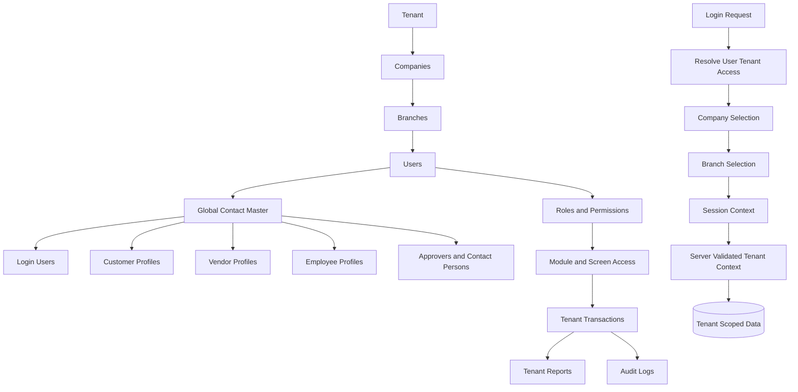
```mermaid
flowchart TD
    Tenant[Tenant] --> Companies[Companies]
    Companies --> Branches[Branches]
    Branches --> Users[Users]
    Users --> GlobalContacts[Global Contact Master]
    GlobalContacts --> UserAccounts[Login Users]
    GlobalContacts --> Customers[Customer Profiles]
    GlobalContacts --> Vendors[Vendor Profiles]
    GlobalContacts --> Employees[Employee Profiles]
    GlobalContacts --> Approvers[Approvers and Contact Persons]
    Users --> Roles[Roles and Permissions]
    Roles --> ModuleAccess[Module and Screen Access]
    ModuleAccess --> Transactions[Tenant Transactions]
    Transactions --> Reports[Tenant Reports]
    Transactions --> Audit[Audit Logs]

    Login[Login Request] --> ResolveTenant[Resolve User Tenant Access]
    ResolveTenant --> CompanySelect[Company Selection]
    CompanySelect --> BranchSelect[Branch Selection]
    BranchSelect --> SessionContext[Session Context]
    SessionContext --> APIContext[Server Validated Tenant Context]
    APIContext --> TenantData[(Tenant Scoped Data)]
```

### Recommended Multi-Tenant Model

| Model | Recommendation |
| --- | --- |
| Tenant identity | Use tenant ID from the authenticated token and server-side session |
| Company isolation | Include `company_id` or `company_code` on all business records |
| Branch isolation | Include `branch_id` or `branch_code` where branch-specific operations exist |
| Schema isolation | If schemas are used, resolve schema server-side from tenant configuration after login |
| Global contact isolation | Use Global Contact as the single party master inside the tenant scope; do not duplicate customer/vendor/employee identity fields in separate masters |
| User access | Store allowed company/branch/module/screen permissions in RBAC tables |
| Audit | Store tenant, company, branch, user, IP address, and request ID in audit logs |

### Global Contact Master Architecture

Global Contact should be the common source for every person and party used in the ERP. Customers, vendors, employees, branch contact persons, approvers, advocates, channel partners, freelancers, subscribers, and other people should be selected from Global Contact and then mapped to the required business role.

In a SaaS setup, Global Contact is global across ERP modules for the tenant. It should remain tenant-aware so one tenant cannot see another tenant's contacts.

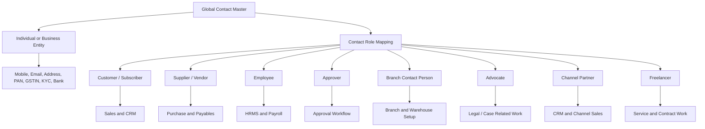
```mermaid
flowchart TD
    GlobalContact[Global Contact Master] --> Identity[Individual or Business Entity]
    Identity --> ContactDetails[Mobile, Email, Address, PAN, GSTIN, KYC, Bank]
    GlobalContact --> RoleMap[Contact Role Mapping]
    RoleMap --> CustomerRole[Customer / Subscriber]
    RoleMap --> VendorRole[Supplier / Vendor]
    RoleMap --> EmployeeRole[Employee]
    RoleMap --> ApproverRole[Approver]
    RoleMap --> BranchContactRole[Branch Contact Person]
    RoleMap --> AdvocateRole[Advocate]
    RoleMap --> ChannelPartnerRole[Channel Partner]
    RoleMap --> FreelancerRole[Freelancer]

    CustomerRole --> Sales[Sales and CRM]
    VendorRole --> Purchase[Purchase and Payables]
    EmployeeRole --> HRMS[HRMS and Payroll]
    ApproverRole --> Workflow[Approval Workflow]
    BranchContactRole --> Branches[Branch and Warehouse Setup]
    AdvocateRole --> Legal[Legal / Case Related Work]
    ChannelPartnerRole --> CRM[CRM and Channel Sales]
    FreelancerRole --> Services[Service and Contract Work]
```

### Global Contact Rules

| Rule | Description |
| --- | --- |
| One identity record | A person or business entity is created once in Global Contact |
| Multiple roles | The same contact can be customer, vendor, employee, approver, or channel partner if business requires |
| Module references | Purchase, sales, accounts, HRMS, workflow, and branch setup should reference `contact_id` |
| Profile extension | Customer, vendor, and employee tables should store only role-specific fields and reference Global Contact |
| Contact person mapping | Business entities can map one or more contact persons from Global Contact |
| Tenant safety | Contact visibility must be filtered by tenant, company, branch, and user permission where required |
| Data quality | Duplicate detection should check mobile, email, PAN, GSTIN, and normalized name |

## 8. Authentication and Role-Based Access Control Flow

### Login Flow

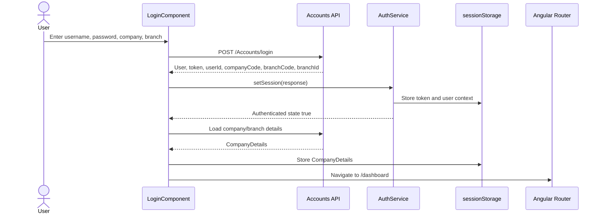
```mermaid
sequenceDiagram
    actor User
    participant Login as LoginComponent
    participant API as Accounts API
    participant Auth as AuthService
    participant Storage as sessionStorage
    participant Router as Angular Router

    User->>Login: Enter username, password, company, branch
    Login->>API: POST /Accounts/login
    API-->>Login: User, token, userId, companyCode, branchCode, branchId
    Login->>Auth: setSession(response)
    Auth->>Storage: Store token and user context
    Auth-->>Login: Authenticated state true
    Login->>API: Load company/branch details
    API-->>Login: CompanyDetails
    Login->>Storage: Store CompanyDetails
    Login->>Router: Navigate to /dashboard
```

### Route Guard Flow

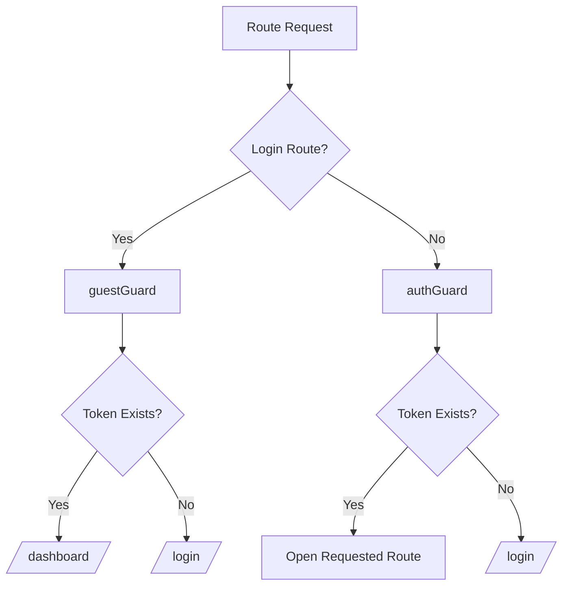
```mermaid
flowchart TD
    RouteRequest[Route Request] --> IsLoginRoute{Login Route?}
    IsLoginRoute -->|Yes| GuestGuard[guestGuard]
    IsLoginRoute -->|No| AuthGuard[authGuard]
    GuestGuard --> GuestAuthenticated{Token Exists?}
    GuestAuthenticated -->|Yes| Dashboard[/dashboard/]
    GuestAuthenticated -->|No| Login[/login/]
    AuthGuard --> Authenticated{Token Exists?}
    Authenticated -->|Yes| RequestedRoute[Open Requested Route]
    Authenticated -->|No| RedirectLogin[/login/]
```

### RBAC Flow

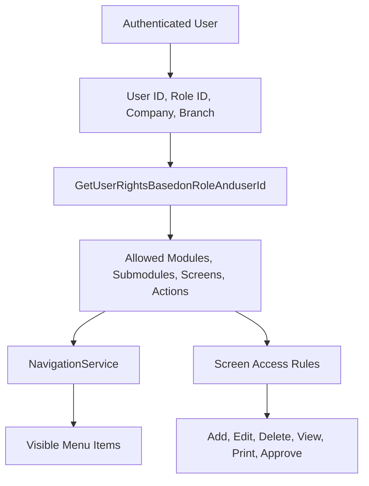
```mermaid
flowchart TD
    UserLogin[Authenticated User] --> UserContext[User ID, Role ID, Company, Branch]
    UserContext --> RightsAPI[GetUserRightsBasedonRoleAnduserId]
    RightsAPI --> Rights[Allowed Modules, Submodules, Screens, Actions]
    Rights --> Navigation[NavigationService]
    Navigation --> Menu[Visible Menu Items]
    Rights --> ScreenAccess[Screen Access Rules]
    ScreenAccess --> Actions[Add, Edit, Delete, View, Print, Approve]
```

### RBAC Recommendations

| Area | Recommendation |
| --- | --- |
| Frontend menu | Use API-provided rights to render modules, submodules, screens, and actions |
| Route protection | Add route-level permission checks in addition to token checks |
| Backend authorization | Validate every API request against user, role, tenant, company, and branch permissions |
| Token handling | Prefer signed JWT or opaque server token with expiry and refresh strategy |
| Sensitive actions | Require explicit permissions for posting, approval, cancellation, export, and reprint |

## 9. Module-Wise Architecture

### Masters

Master data supports all transaction modules. Inventory route files show a broad set of master screens, and accounts/settings contain banking, company, user rights, and configuration flows.

| Master Area | Screens / Entities | Used By |
| --- | --- | --- |
| Company and branch | Company setup, branch master, business segments | All modules |
| Product and item | Product/service master, category, product group, brand, attributes, variants, UOM | Purchase, inventory, sales, reports |
| Tax and classification | HSN/SAC mapping, GST applicability | Purchase, sales, accounts, GST reports |
| Warehouse | Warehouse/location master, opening inventory balance | Inventory, purchase, sales |
| Vendor | Vendor profile pulled from Global Contact, payment terms | Purchase, accounts |
| Customer | Customer profile pulled from Global Contact, price list | Sales, CRM, accounts |
| Manufacturing | BOM, work center, consumption type | Inventory and production |
| Approval | Approval workflow master | Purchase, inventory, sales, accounts |
| Banking | Bank config, cheque management, UPI details | Accounts and receipt/payment workflows |
| HRMS | Employee, attendance, payroll settings | HRMS and payroll |

#### Masters Module Flow

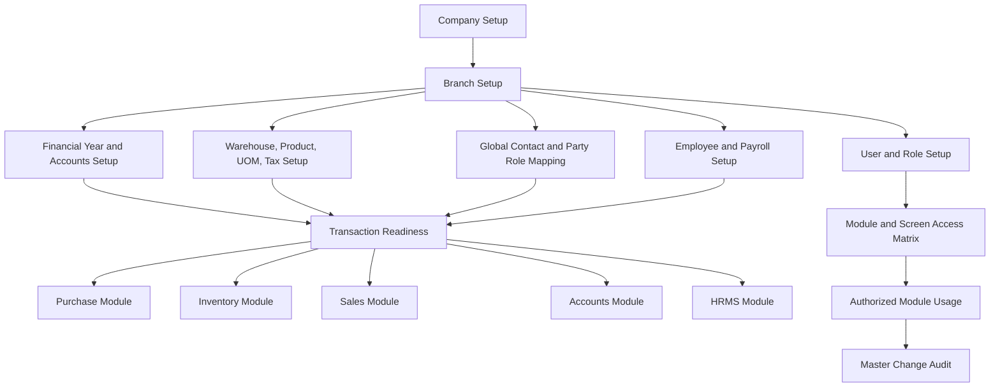
```mermaid
flowchart TD
    CompanySetup[Company Setup] --> BranchSetup[Branch Setup]
    BranchSetup --> UserSetup[User and Role Setup]
    BranchSetup --> FinanceSetup[Financial Year and Accounts Setup]
    BranchSetup --> InventorySetup[Warehouse, Product, UOM, Tax Setup]
    BranchSetup --> PartySetup[Global Contact and Party Role Mapping]
    BranchSetup --> HRSetup[Employee and Payroll Setup]

    UserSetup --> AccessMatrix[Module and Screen Access Matrix]
    FinanceSetup --> TransactionReadiness[Transaction Readiness]
    InventorySetup --> TransactionReadiness
    PartySetup --> TransactionReadiness
    HRSetup --> TransactionReadiness

    TransactionReadiness --> Purchase[Purchase Module]
    TransactionReadiness --> Inventory[Inventory Module]
    TransactionReadiness --> Sales[Sales Module]
    TransactionReadiness --> Accounts[Accounts Module]
    TransactionReadiness --> HRMS[HRMS Module]
    AccessMatrix --> AuthorizedUse[Authorized Module Usage]
    AuthorizedUse --> Audit[Master Change Audit]
```

### Purchase

The purchase architecture supports procurement from requisition to stock receipt.

| Purchase Stage | Frontend Route / Screen | Main Responsibility |
| --- | --- | --- |
| Purchase requisition | `purchase-requisition` | Internal demand capture |
| Request for quotation | `request-for-quotation` | Vendor quotation process |
| Purchase order | `purchase-order` | Approved vendor order |
| Goods receipt | `goods-receipt` | Physical stock receipt and inventory update |
| Purchase return | `purchase-return` | Return goods to vendor |
| Debit note | `debit-note` | Financial adjustment against vendor |

#### Purchase Module Flow

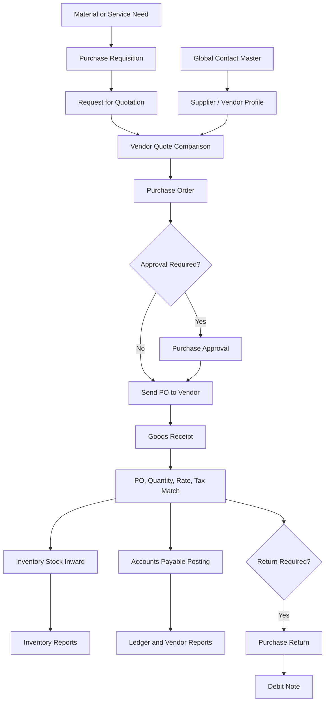
```mermaid
flowchart TD
    GlobalContact[Global Contact Master] --> VendorProfile[Supplier / Vendor Profile]
    Need[Material or Service Need] --> PR[Purchase Requisition]
    PR --> RFQ[Request for Quotation]
    RFQ --> Compare[Vendor Quote Comparison]
    VendorProfile --> Compare
    Compare --> PO[Purchase Order]
    PO --> Approval{Approval Required?}
    Approval -->|Yes| Approve[Purchase Approval]
    Approval -->|No| SendVendor[Send PO to Vendor]
    Approve --> SendVendor
    SendVendor --> GRN[Goods Receipt]
    GRN --> Match[PO, Quantity, Rate, Tax Match]
    Match --> StockIn[Inventory Stock Inward]
    Match --> Payable[Accounts Payable Posting]
    StockIn --> InventoryReports[Inventory Reports]
    Payable --> LedgerReports[Ledger and Vendor Reports]
    Match --> ReturnRequired{Return Required?}
    ReturnRequired -->|Yes| PurchaseReturn[Purchase Return]
    PurchaseReturn --> DebitNote[Debit Note]
```

### Inventory

Inventory is the largest visible feature area in the frontend. It includes stock control, warehouse operations, barcode/batch/serial policies, manufacturing, logistics, and reports.

| Inventory Area | Screens / Entities |
| --- | --- |
| Setup | Warehouse location, opening inventory balance, barcode configuration, serial number policy, batch/lot policy |
| Stock transactions | Stock transfer, stock adjustment, opening stock entry, cycle count |
| Manufacturing | Production planning, material issue to production, production entry, production return |
| Consumption | Material consumption, internal issue slip |
| Logistics | Shipment entry, gate pass, transporter master, vehicle master |
| Reports | Inventory summary and dynamic inventory report shell |

#### Inventory Module Flow

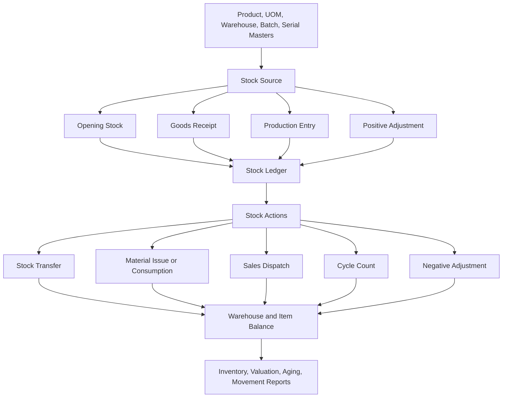
```mermaid
flowchart TD
    InventoryMasters[Product, UOM, Warehouse, Batch, Serial Masters] --> StockSources[Stock Source]
    StockSources --> Opening[Opening Stock]
    StockSources --> PurchaseReceipt[Goods Receipt]
    StockSources --> ProductionReceipt[Production Entry]
    StockSources --> AdjustmentIn[Positive Adjustment]

    Opening --> StockLedger[Stock Ledger]
    PurchaseReceipt --> StockLedger
    ProductionReceipt --> StockLedger
    AdjustmentIn --> StockLedger

    StockLedger --> StockActions[Stock Actions]
    StockActions --> Transfer[Stock Transfer]
    StockActions --> Issue[Material Issue or Consumption]
    StockActions --> SalesDispatch[Sales Dispatch]
    StockActions --> CycleCount[Cycle Count]
    StockActions --> AdjustmentOut[Negative Adjustment]

    Transfer --> Balance[Warehouse and Item Balance]
    Issue --> Balance
    SalesDispatch --> Balance
    CycleCount --> Balance
    AdjustmentOut --> Balance
    Balance --> Reports[Inventory, Valuation, Aging, Movement Reports]
```

### Sales

Sales routes support enquiry-to-invoice and return flows.

| Sales Stage | Frontend Route / Screen | Main Responsibility |
| --- | --- | --- |
| Sales enquiry | `sales-enquiry` | Initial customer inquiry |
| Sales quotation | `sales-quotation` | Quoted prices and commercial terms |
| Sales order | `sales-order` | Confirmed customer order |
| Delivery challan | `delivery-challan` | Dispatch documentation |
| Sales invoice | `sales-invoice` | Billing, tax, and accounting impact |
| Sales return | `sales-return` | Customer return and stock/accounting reversal |
| Credit note | `credit-note` | Customer financial adjustment |

#### Sales Module Flow

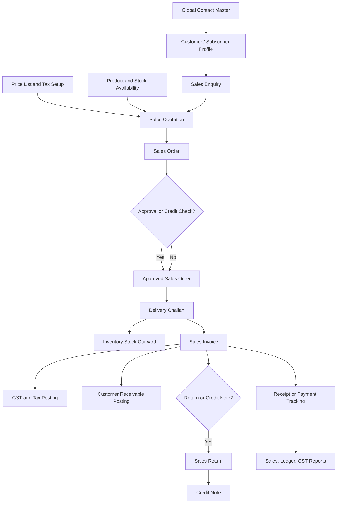
```mermaid
flowchart TD
    GlobalContact[Global Contact Master] --> CustomerProfile[Customer / Subscriber Profile]
    CustomerProfile --> Enquiry[Sales Enquiry]
    PriceList[Price List and Tax Setup] --> Quotation[Sales Quotation]
    ProductStock[Product and Stock Availability] --> Quotation
    Enquiry --> Quotation
    Quotation --> SalesOrder[Sales Order]
    SalesOrder --> Approval{Approval or Credit Check?}
    Approval -->|Yes| ApprovedOrder[Approved Sales Order]
    Approval -->|No| ApprovedOrder
    ApprovedOrder --> Delivery[Delivery Challan]
    Delivery --> StockOut[Inventory Stock Outward]
    Delivery --> Invoice[Sales Invoice]
    Invoice --> GST[GST and Tax Posting]
    Invoice --> AccountsPosting[Customer Receivable Posting]
    Invoice --> Payment[Receipt or Payment Tracking]
    Invoice --> ReturnCheck{Return or Credit Note?}
    ReturnCheck -->|Yes| SalesReturn[Sales Return]
    SalesReturn --> CreditNote[Credit Note]
    Payment --> Reports[Sales, Ledger, GST Reports]
```

### Accounts

Accounts contains configuration, transactions, reports, voucher printing, banking, cheque, petty cash, GST, TDS, and trial balance flows.

| Accounts Area | Screens / Entities |
| --- | --- |
| Configuration | Bank config, company config, cheque management |
| Receipts | General receipt, general receipt cancel, petty cash receipt cancel |
| Payments | Payment voucher, petty cash, funds transfer out |
| Journals | Journal voucher, TDS JV |
| Banking | Cheques on hand, in bank, issued, BRS, bank book, bank entries |
| Reports | Account ledger, account summary, cash book, day book, trial balance, comparison TB, schedule TB, GST report, TDS report |
| Printing | Payment voucher, general receipt, journal voucher printable routes |

#### Accounts Module Flow

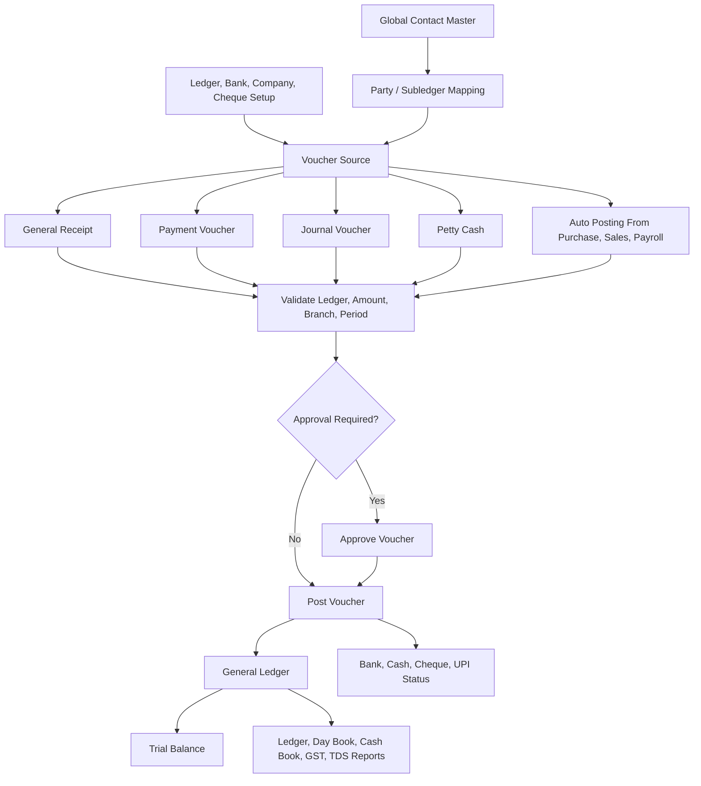
```mermaid
flowchart TD
    GlobalContact[Global Contact Master] --> PartySubledger[Party / Subledger Mapping]
    AccountMasters[Ledger, Bank, Company, Cheque Setup] --> VoucherSource[Voucher Source]
    PartySubledger --> VoucherSource
    VoucherSource --> Receipt[General Receipt]
    VoucherSource --> Payment[Payment Voucher]
    VoucherSource --> Journal[Journal Voucher]
    VoucherSource --> PettyCash[Petty Cash]
    VoucherSource --> AutoPosting[Auto Posting From Purchase, Sales, Payroll]

    Receipt --> VoucherValidation[Validate Ledger, Amount, Branch, Period]
    Payment --> VoucherValidation
    Journal --> VoucherValidation
    PettyCash --> VoucherValidation
    AutoPosting --> VoucherValidation

    VoucherValidation --> Approval{Approval Required?}
    Approval -->|Yes| ApproveVoucher[Approve Voucher]
    Approval -->|No| PostVoucher[Post Voucher]
    ApproveVoucher --> PostVoucher
    PostVoucher --> Ledger[General Ledger]
    PostVoucher --> BankCash[Bank, Cash, Cheque, UPI Status]
    Ledger --> TrialBalance[Trial Balance]
    Ledger --> AccountReports[Ledger, Day Book, Cash Book, GST, TDS Reports]
```

### HRMS

HRMS contains payroll, attendance, employee, statutory, and report workflows.

| HRMS Area | Screens / Entities |
| --- | --- |
| Dashboard | HRMS dashboard |
| Employee payroll | Employee on roll, payroll process, payroll approval |
| Attendance | Employee attendance, biometric attendance |
| Payroll posting | JV details, KHC details |
| Statutory reports | ESI statement, PF statement, professional tax |
| Employee reports | Salary statement, payslip, bonus, earned leaves, loyalty statement, transferred employees |
| Biometric reports | Biometric report, biometric summary report, biometric modifications |

#### HRMS Module Flow

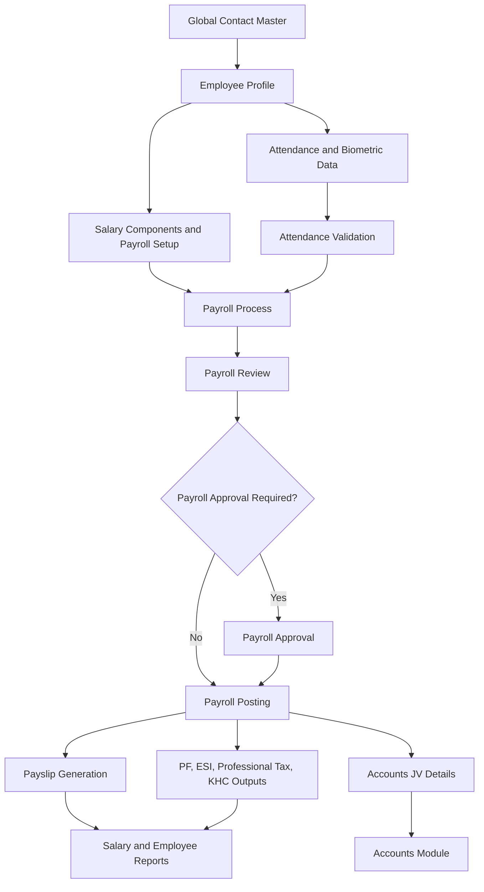
```mermaid
flowchart TD
    GlobalContact[Global Contact Master] --> EmployeeMaster[Employee Profile]
    EmployeeMaster --> Attendance[Attendance and Biometric Data]
    EmployeeMaster --> SalarySetup[Salary Components and Payroll Setup]
    Attendance --> AttendanceValidation[Attendance Validation]
    SalarySetup --> PayrollProcess[Payroll Process]
    AttendanceValidation --> PayrollProcess
    PayrollProcess --> PayrollReview[Payroll Review]
    PayrollReview --> Approval{Payroll Approval Required?}
    Approval -->|Yes| PayrollApproval[Payroll Approval]
    Approval -->|No| PayrollPosting[Payroll Posting]
    PayrollApproval --> PayrollPosting
    PayrollPosting --> Payslip[Payslip Generation]
    PayrollPosting --> Statutory[PF, ESI, Professional Tax, KHC Outputs]
    PayrollPosting --> AccountsJV[Accounts JV Details]
    Payslip --> HRReports[Salary and Employee Reports]
    Statutory --> HRReports
    AccountsJV --> Accounts[Accounts Module]
```

### Reports

Reports are implemented as both fixed screens and configurable report shells.

| Report Area | Architecture |
| --- | --- |
| Accounts reports | Route-specific reports for ledger, book, GST, TDS, trial balance, voucher lists |
| Inventory reports | Dynamic `:reportKey` route backed by `InventoryReportsService` |
| HRMS reports | Generic `HrmsReportShell` with configurable fields and export actions |
| Export | Excel via `xlsx`, PDF via `jsPDF` and `jspdf-autotable`, print via browser print |
| Context | Company, branch, user, role, financial year, date range, and filters are included in report requests |

#### Reports Module Flow

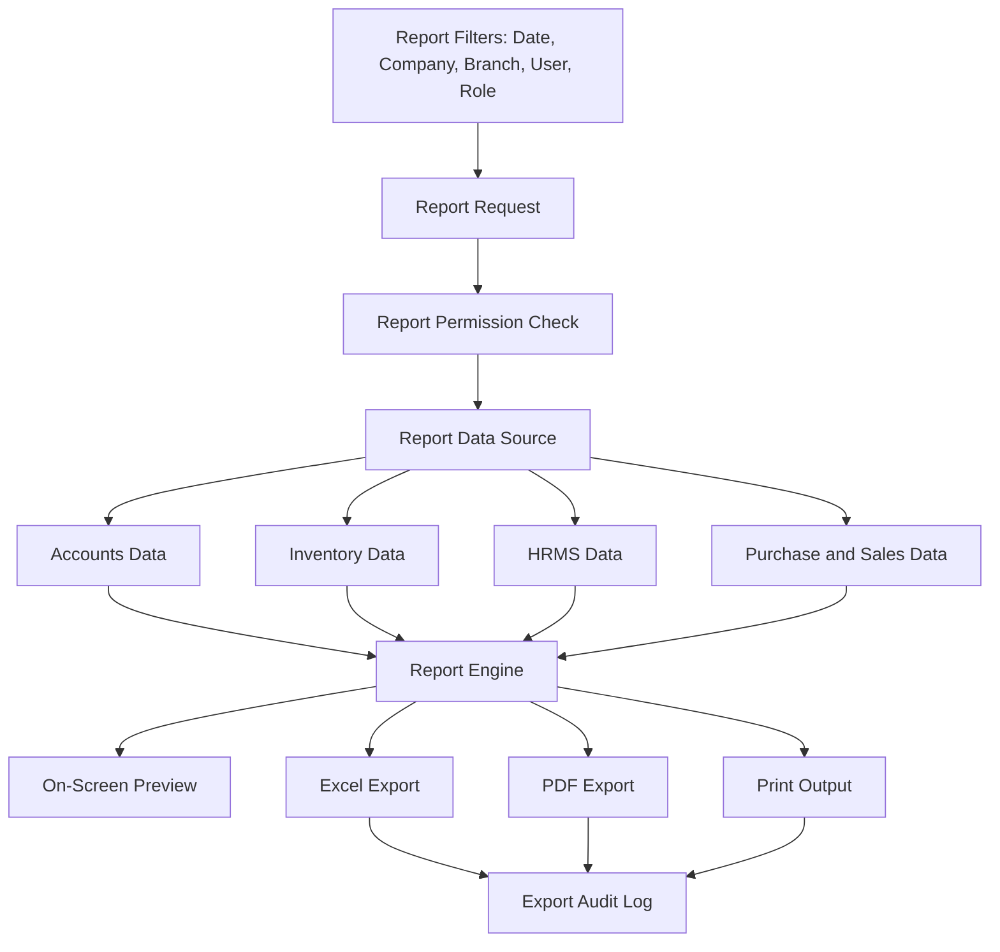
```mermaid
flowchart TD
    UserFilters[Report Filters: Date, Company, Branch, User, Role] --> ReportRequest[Report Request]
    ReportRequest --> PermissionCheck[Report Permission Check]
    PermissionCheck --> DataSource[Report Data Source]
    DataSource --> AccountsData[Accounts Data]
    DataSource --> InventoryData[Inventory Data]
    DataSource --> HRMSData[HRMS Data]
    DataSource --> PurchaseSalesData[Purchase and Sales Data]
    AccountsData --> ReportEngine[Report Engine]
    InventoryData --> ReportEngine
    HRMSData --> ReportEngine
    PurchaseSalesData --> ReportEngine
    ReportEngine --> Preview[On-Screen Preview]
    ReportEngine --> Excel[Excel Export]
    ReportEngine --> PDF[PDF Export]
    ReportEngine --> Print[Print Output]
    Excel --> ExportAudit[Export Audit Log]
    PDF --> ExportAudit
    Print --> ExportAudit
```

### Dashboard And Settings Flow

Dashboard and Settings are cross-cutting modules. Dashboard consumes summarized data from multiple modules, while Settings controls application configuration, user rights, and administrative setup.

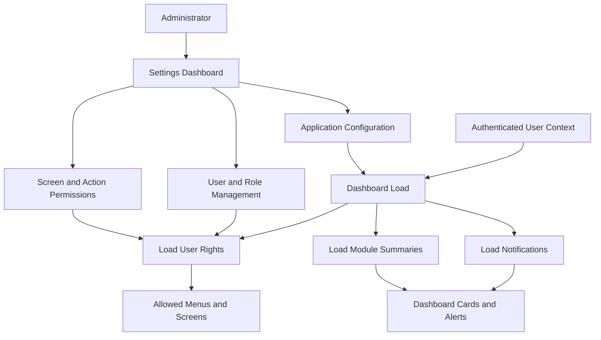
```mermaid
flowchart TD
    LoginContext[Authenticated User Context] --> DashboardLoad[Dashboard Load]
    DashboardLoad --> Rights[Load User Rights]
    DashboardLoad --> Notifications[Load Notifications]
    DashboardLoad --> ModuleSummary[Load Module Summaries]
    Rights --> Menu[Allowed Menus and Screens]
    Notifications --> DashboardCards[Dashboard Cards and Alerts]
    ModuleSummary --> DashboardCards

    AdminUser[Administrator] --> Settings[Settings Dashboard]
    Settings --> UserRoles[User and Role Management]
    Settings --> Permissions[Screen and Action Permissions]
    Settings --> AppConfig[Application Configuration]
    UserRoles --> Rights
    Permissions --> Rights
    AppConfig --> DashboardLoad
```

## 10. Transaction Flow Diagrams

### Inventory Transaction Flow

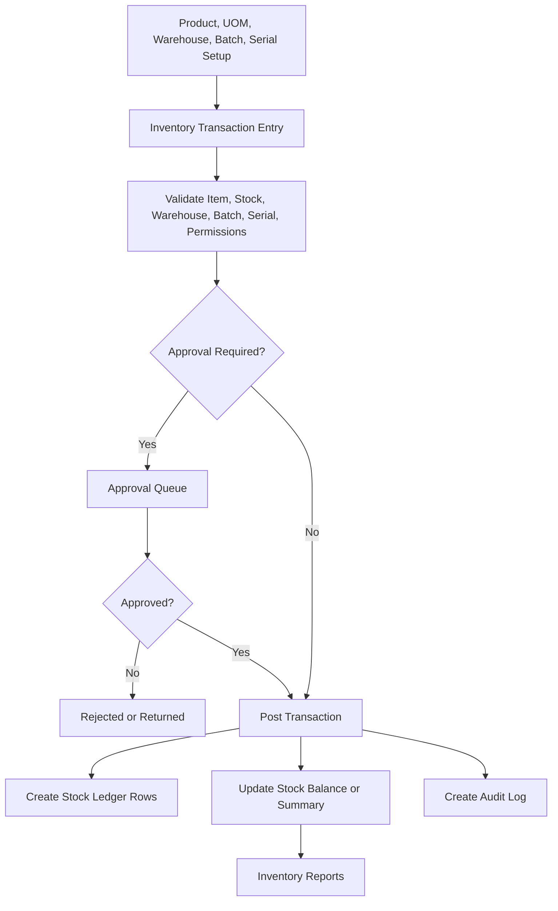
```mermaid
flowchart TD
    MasterSetup[Product, UOM, Warehouse, Batch, Serial Setup] --> Transaction[Inventory Transaction Entry]
    Transaction --> Validation[Validate Item, Stock, Warehouse, Batch, Serial, Permissions]
    Validation --> ApprovalNeeded{Approval Required?}
    ApprovalNeeded -->|Yes| ApprovalQueue[Approval Queue]
    ApprovalQueue --> Approved{Approved?}
    Approved -->|No| Rejected[Rejected or Returned]
    Approved -->|Yes| Posting[Post Transaction]
    ApprovalNeeded -->|No| Posting
    Posting --> StockLedger[Create Stock Ledger Rows]
    Posting --> Balance[Update Stock Balance or Summary]
    Posting --> Audit[Create Audit Log]
    Balance --> Reports[Inventory Reports]
```

### Purchase-To-Stock Flow

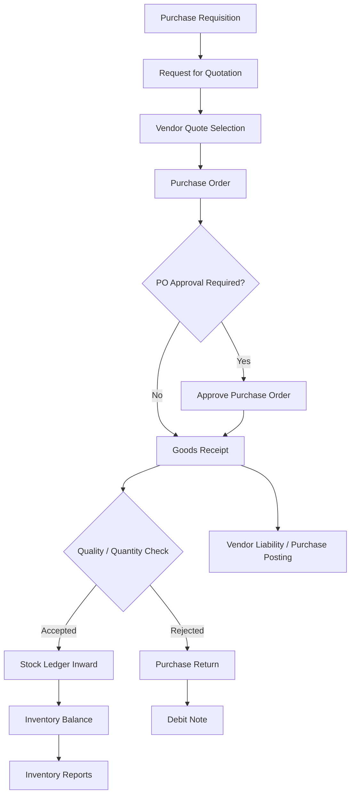
```mermaid
flowchart TD
    PR[Purchase Requisition] --> RFQ[Request for Quotation]
    RFQ --> VendorQuote[Vendor Quote Selection]
    VendorQuote --> PO[Purchase Order]
    PO --> POApproval{PO Approval Required?}
    POApproval -->|Yes| ApprovePO[Approve Purchase Order]
    POApproval -->|No| GRN[Goods Receipt]
    ApprovePO --> GRN
    GRN --> QC{Quality / Quantity Check}
    QC -->|Rejected| PurchaseReturn[Purchase Return]
    QC -->|Accepted| StockLedger[Stock Ledger Inward]
    StockLedger --> InventoryBalance[Inventory Balance]
    GRN --> AccountsPayable[Vendor Liability / Purchase Posting]
    PurchaseReturn --> DebitNote[Debit Note]
    InventoryBalance --> InventoryReports[Inventory Reports]
```

### Sale Invoice Flow

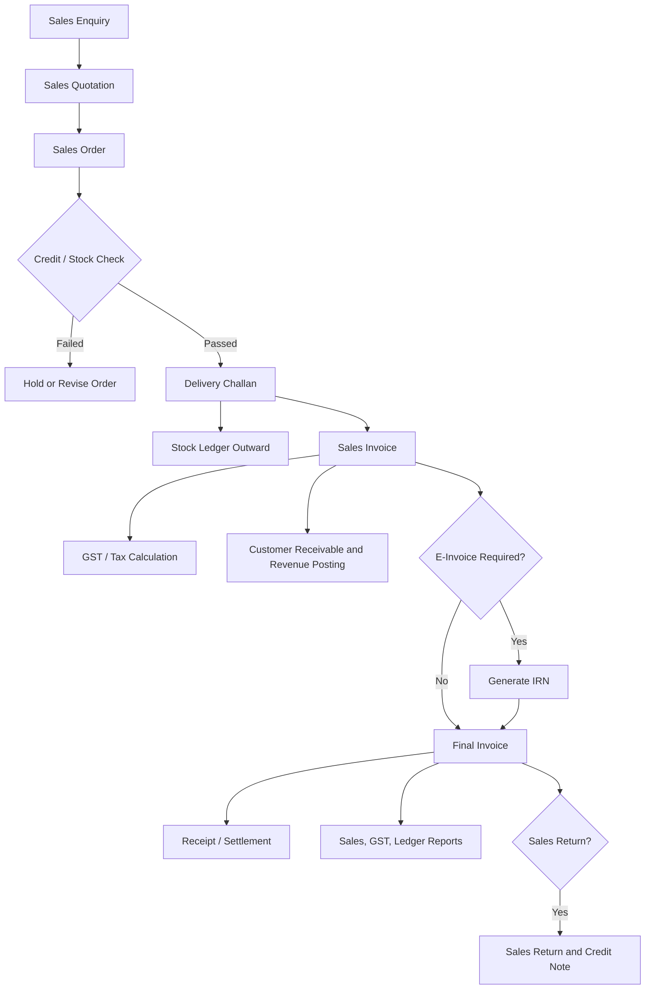
```mermaid
flowchart TD
    Enquiry[Sales Enquiry] --> Quotation[Sales Quotation]
    Quotation --> SalesOrder[Sales Order]
    SalesOrder --> CreditCheck{Credit / Stock Check}
    CreditCheck -->|Failed| Hold[Hold or Revise Order]
    CreditCheck -->|Passed| Delivery[Delivery Challan]
    Delivery --> StockOut[Stock Ledger Outward]
    Delivery --> Invoice[Sales Invoice]
    Invoice --> Tax[GST / Tax Calculation]
    Invoice --> Accounting[Customer Receivable and Revenue Posting]
    Invoice --> EInvoice{E-Invoice Required?}
    EInvoice -->|Yes| IRN[Generate IRN]
    EInvoice -->|No| FinalInvoice[Final Invoice]
    IRN --> FinalInvoice
    FinalInvoice --> Payment[Receipt / Settlement]
    FinalInvoice --> Reports[Sales, GST, Ledger Reports]
    FinalInvoice --> Return{Sales Return?}
    Return -->|Yes| SalesReturn[Sales Return and Credit Note]
```

### Accounts Voucher Flow

```mermaid
flowchart TD
    VoucherEntry[Voucher Entry] --> Validate[Validate Ledger, Amount, Branch, Fiscal Period]
    Validate --> Approval{Approval Required?}
    Approval -->|Yes| VoucherApproval[Voucher Approval]
    VoucherApproval --> Post[Post Voucher]
    Approval -->|No| Post
    Post --> Ledger[Update Ledger Entries]
    Post --> BankCash[Update Bank / Cash / Cheque Status]
    Post --> Audit[Audit Log]
    Ledger --> TrialBalance[Trial Balance]
    Ledger --> LedgerReport[Ledger and Day Book Reports]
```

## 11. API Request/Response Flow

Most API calls use Angular services. Many shared calls go through `CommonService`, which loads the API host from session storage and submits GET or POST requests.

```mermaid
sequenceDiagram
    actor User
    participant Component as Angular Component
    participant Service as Feature Service
    participant Common as CommonService
    participant Storage as sessionStorage
    participant API as REST API
    participant DB as Database

    User->>Component: Perform action
    Component->>Service: Call domain method
    Service->>Common: Build API request
    Common->>Storage: Read apiURL, company, branch, user
    Common->>API: HTTP GET/POST with payload and context
    API->>API: Authenticate, authorize, validate tenant
    API->>DB: Execute query or transaction
    DB-->>API: Result
    API-->>Common: JSON response
    Common-->>Service: Parsed response
    Service-->>Component: Data or status
    Component-->>User: Update UI
```

### Recommended Standard API Response Contract

```json
{
  "success": true,
  "message": "Operation completed successfully",
  "data": {},
  "errors": [],
  "requestId": "REQ-20260514-0001",
  "timestamp": "2026-05-14T00:00:00Z"
}
```

### API Design Guidelines

| Guideline | Description |
| --- | --- |
| Resource naming | Use clear module-based routes such as `/inventory/purchase-orders` |
| DTO validation | Validate all request DTOs server-side |
| Tenant validation | Resolve tenant/company/branch from authenticated user context |
| Idempotency | Use idempotency keys for payment, invoice, stock posting, and integration calls |
| Pagination | Use page number, page size, sort, and filters for list/report APIs |
| Error format | Return consistent error objects with request ID and validation details |
| Audit context | Capture user, IP, tenant, company, branch, and action for all write APIs |

## 12. Database Table Relationship Overview

The following ER diagram is logical. Exact table names may differ in the backend database.

```mermaid
erDiagram
    TENANT ||--o{ COMPANY : owns
    COMPANY ||--o{ BRANCH : has
    COMPANY ||--o{ FINANCIAL_YEAR : defines
    COMPANY ||--o{ USER_ACCOUNT : employs
    USER_ACCOUNT }o--o{ ROLE : assigned
    ROLE }o--o{ PERMISSION : grants
    USER_ACCOUNT }o--o{ BRANCH : accesses

    COMPANY ||--o{ GLOBAL_CONTACT : has
    GLOBAL_CONTACT ||--o{ CONTACT_ROLE_MAP : assigned_to
    GLOBAL_CONTACT ||--o{ CONTACT_ADDRESS : has
    GLOBAL_CONTACT ||--o{ CONTACT_KYC : has
    GLOBAL_CONTACT ||--o{ CONTACT_BANK : has
    GLOBAL_CONTACT ||--o{ CONTACT_PERSON_MAP : maps
    GLOBAL_CONTACT ||--o{ CUSTOMER_PROFILE : extends
    GLOBAL_CONTACT ||--o{ VENDOR_PROFILE : extends
    GLOBAL_CONTACT ||--o{ EMPLOYEE_PROFILE : extends
    COMPANY ||--o{ PRODUCT : has
    PRODUCT }o--|| UOM : uses
    PRODUCT }o--|| HSN_SAC : classified_by
    BRANCH ||--o{ WAREHOUSE : owns
    WAREHOUSE ||--o{ STOCK_LEDGER : records
    PRODUCT ||--o{ STOCK_LEDGER : moves

    VENDOR_PROFILE ||--o{ PURCHASE_ORDER : receives
    PURCHASE_ORDER ||--o{ PURCHASE_ORDER_LINE : contains
    PURCHASE_ORDER ||--o{ GOODS_RECEIPT : fulfilled_by
    GOODS_RECEIPT ||--o{ GOODS_RECEIPT_LINE : contains
    GOODS_RECEIPT_LINE ||--o{ STOCK_LEDGER : posts

    CUSTOMER_PROFILE ||--o{ SALES_ORDER : places
    SALES_ORDER ||--o{ SALES_ORDER_LINE : contains
    SALES_ORDER ||--o{ SALES_INVOICE : billed_by
    SALES_INVOICE ||--o{ SALES_INVOICE_LINE : contains
    SALES_INVOICE_LINE ||--o{ STOCK_LEDGER : posts

    BRANCH ||--o{ VOUCHER : posts
    VOUCHER ||--o{ VOUCHER_LINE : contains
    LEDGER_ACCOUNT ||--o{ VOUCHER_LINE : affected_by

    BRANCH ||--o{ EMPLOYEE_PROFILE : employs
    EMPLOYEE_PROFILE ||--o{ ATTENDANCE : records
    EMPLOYEE_PROFILE ||--o{ PAYROLL_RUN_LINE : paid_in
    PAYROLL_RUN ||--o{ PAYROLL_RUN_LINE : contains

    USER_ACCOUNT ||--o{ AUDIT_LOG : creates
    USER_ACCOUNT ||--o{ APPROVAL_HISTORY : acts_on
```

### Common Columns

| Column | Purpose |
| --- | --- |
| `tenant_id` | SaaS tenant isolation |
| `company_id` / `company_code` | Company context |
| `branch_id` / `branch_code` | Branch context |
| `financial_year_id` | Fiscal period context |
| `document_no` | Human-readable business document number |
| `status` | Draft, pending approval, approved, posted, cancelled, rejected |
| `created_by`, `created_at` | Creation audit |
| `updated_by`, `updated_at` | Modification audit |
| `posted_by`, `posted_at` | Financial or inventory posting audit |
| `approved_by`, `approved_at` | Approval audit |

## 13. External Integrations

The repository contains references to GST reports, GST voucher posting, HSN/SAC mapping, UPI, PayTm/Cashfree status, EmailJS, SOS ticket email, and WhatsApp links. E-Invoice and E-Way Bill are required ERP integrations but no complete frontend implementation was found in the inspected files.

| Integration | Current Evidence / Expected Use | Architecture Recommendation |
| --- | --- | --- |
| GST | GST report routes and APIs, GST voucher/bill references, HSN/SAC mapping | Keep GST calculation server-side; store tax breakup per line; generate GST reports from posted transactions |
| E-Invoice | Not found as a complete implemented module in frontend | Add backend integration service for IRN generation, cancellation, status check, QR code storage, and retry logs |
| E-Way Bill | Not found as a complete implemented module in frontend | Add backend integration service for generation, update vehicle, cancellation, expiry tracking, and transporter details |
| Email / SMTP | EmailJS SDK and SOS support ticket email flow | Use backend SMTP for official transactional mail; reserve EmailJS for non-critical browser-side support fallback |
| WhatsApp / SMS | WhatsApp link patterns found in UI | Centralize message templates and send through approved WhatsApp Business/SMS provider from backend |
| Payment Gateway | UPI details, PayTm and Cashfree references found | Use backend payment service for order creation, webhook validation, reconciliation, and idempotency |

### Integration Pattern

```mermaid
flowchart TD
    ERPModule[ERP Module] --> IntegrationAPI[Backend Integration API]
    IntegrationAPI --> Queue[Retry Queue / Outbox]
    Queue --> ProviderAdapter[Provider Adapter]
    ProviderAdapter --> ExternalProvider[External Provider]
    ExternalProvider --> Webhook[Webhook Callback]
    Webhook --> Verify[Signature and Payload Verification]
    Verify --> IntegrationLog[Integration Log]
    IntegrationLog --> ERPStatus[Update ERP Document Status]
```

## 14. Deployment Architecture

The Angular frontend is built as static assets and can be deployed behind a web server or CDN. The frontend calls the configured backend API.

```mermaid
flowchart LR
    Developer[Developer] --> Build[npm run build]
    Build --> Artifacts[Static Angular Artifacts]
    Artifacts --> WebServer[Web Server / CDN]
    User[User Browser] --> WebServer
    User --> API[REST API Server]
    API --> Database[(Database Server)]
    API --> FileStore[(File / Document Storage)]
    API --> Integrations[External Integrations]
```

### Deployment Components

| Component | Responsibility |
| --- | --- |
| Angular static host | Serves `index.html`, JavaScript bundles, styles, and assets |
| API server | Provides ERP business APIs and integration APIs |
| Database server | Stores tenant, master, transaction, report, and audit data |
| File storage | Stores generated reports, attachments, invoice PDFs, QR codes, and import/export files |
| Background workers | Process integrations, notifications, report generation, and retries |
| Monitoring | Logs, metrics, alerts, uptime, API latency, error tracking |

### Environment Configuration

| Environment | Purpose |
| --- | --- |
| Development | Local UI development and integration testing |
| Test / QA | Functional testing, regression testing, UAT preparation |
| UAT | Stakeholder validation using near-production data |
| Production | Live customer operations |

The current frontend reads API configuration from Angular environment files and `src/assets/appsettings.json`. Production deployment should ensure that `appsettings.json` points to the correct API host for the environment.

## 15. Security Considerations

| Security Area | Current / Required Consideration |
| --- | --- |
| Authentication | Current frontend checks token existence in `sessionStorage`; backend must validate token expiry and signature/session |
| Authorization | User-rights API exists; backend must enforce RBAC for every write/read operation |
| Tenant isolation | Company and branch context is client-visible; backend must resolve and validate access server-side |
| Token storage | `sessionStorage` is vulnerable to XSS token theft; consider secure HTTP-only cookies or strict XSS controls |
| HTTP interceptor | Add an Angular HTTP interceptor for token, request ID, error handling, and unauthorized redirects |
| Input validation | Validate all forms client-side and server-side |
| Output encoding | Prevent XSS in dynamic report, table, and print content |
| CSRF | Required if cookie-based authentication is introduced |
| Audit logs | Record user, tenant, branch, action, document, old values, new values, IP address, and timestamp |
| Sensitive exports | Restrict Excel/PDF exports by permission and log export events |
| Integration secrets | Store GST, payment, SMTP, SMS, and WhatsApp credentials server-side only |
| File uploads | Validate type, size, malware risk, and authorization |
| Error messages | Show user-friendly messages but keep stack traces server-side |

## 16. Future Scalability Recommendations

| Recommendation | Benefit |
| --- | --- |
| Formalize backend OpenAPI specification | Enables typed API clients, better QA, and clear frontend/backend contracts |
| Add typed DTO models per module | Reduces runtime errors and improves maintainability |
| Centralize HTTP handling with interceptors | Standardizes token, tenant headers, loading state, errors, and retries |
| Move fixed schema methods to server-authoritative tenant resolver | Prevents client-side tenant spoofing and supports real multi-tenancy |
| Split large shared services by responsibility | Keeps API, formatting, export, date, report, and utility logic easier to maintain |
| Implement route-level permission guards | Prevents users from accessing screens by direct URL |
| Add lazy loading for all heavy feature areas | Reduces initial bundle size |
| Add server-side pagination and report streaming | Supports large ledgers, payroll, and inventory reports |
| Use outbox pattern for integrations | Improves reliability for GST, e-invoice, e-way bill, payments, email, and WhatsApp |
| Add background jobs | Handles report generation, retries, notifications, and reconciliation |
| Add observability | Improves production support through logs, metrics, traces, and request IDs |
| Add automated tests | Protects login, RBAC, posting, reports, and critical transactions from regressions |
| Introduce feature flags | Allows phased rollout of modules and tenant-specific capabilities |
| Add cache strategy | Improves performance for masters, menu rights, dashboard cards, and reference data |

## Appendix A. Observed Frontend Modules And Routes

| Module | Route Group | Examples |
| --- | --- | --- |
| Dashboard | `/dashboard` | Dashboard home, contacts, SOS dashboard |
| Accounts | `/dashboard/accounts` | General receipt, payment voucher, journal voucher, petty cash, bank book, trial balance, GST report |
| Inventory | `/dashboard/inventory` | Product master, purchase order, goods receipt, sales invoice, stock transfer, production entry, inventory reports |
| HRMS | `/dashboard/hrms` | Employee on roll, attendance, payroll process, payroll approval, statutory reports |
| Settings | `/dashboard/settings` | Settings dashboard and user-rights related APIs |
| Printable vouchers | Root-level protected routes | Payment voucher, general receipt, journal voucher |

## Appendix B. Architecture Ownership Matrix

| Area | Primary Owner | Supporting Roles |
| --- | --- | --- |
| Business modules | Business analysts and product owners | Developers, QA, project managers |
| Frontend architecture | Frontend developers | UI/UX, QA |
| Backend architecture | Backend developers | DBAs, DevOps, security |
| Database architecture | DBAs and backend developers | Business analysts, report developers |
| Security and RBAC | Security owner and backend developers | Frontend developers, QA |
| Reports | Report developers and business analysts | DBAs, module owners |
| Deployment | DevOps | Developers, QA, support |
| Integrations | Backend developers | Finance/tax teams, vendors, DevOps |
