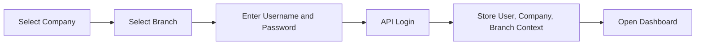
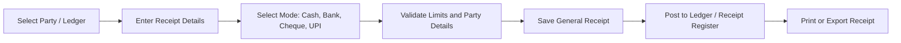
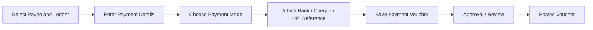
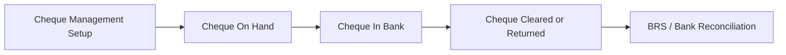
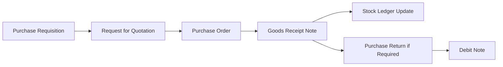
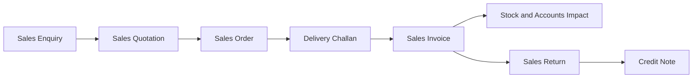
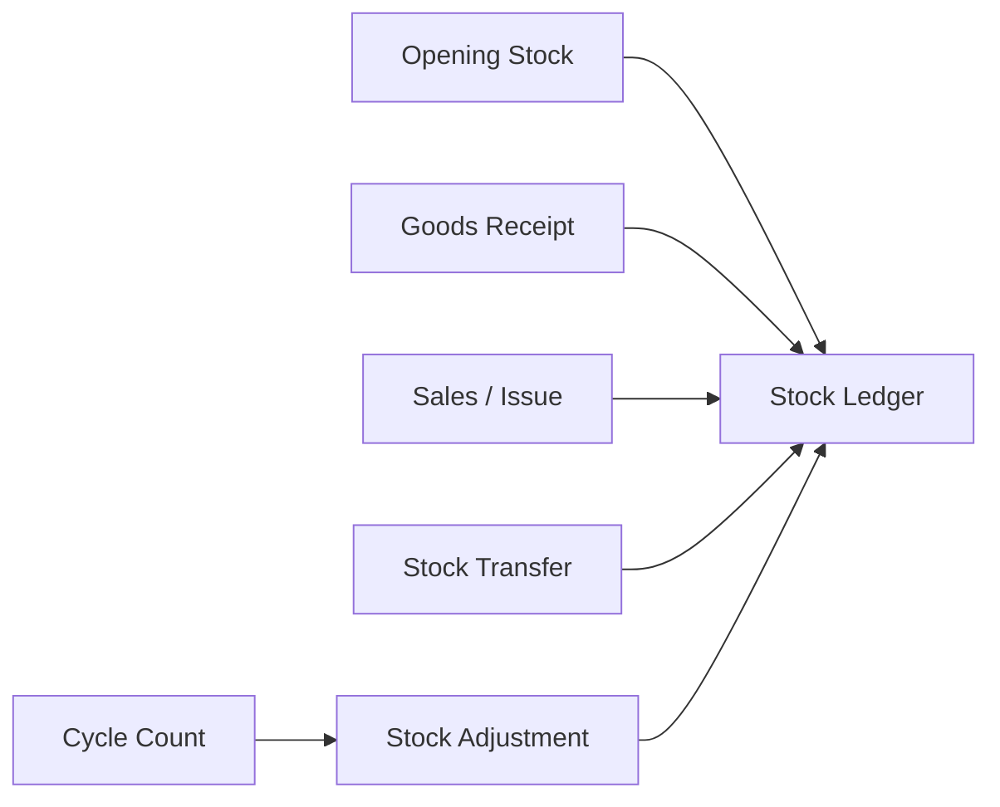
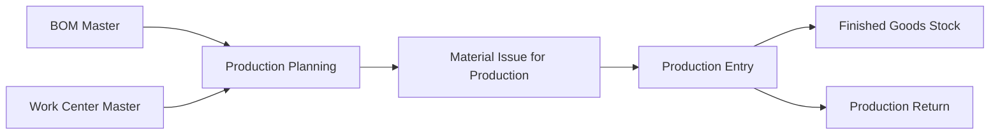
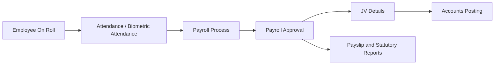

# Business Architecture Document

Document date: 14-May-2026  
Project: Global ERP V21  
Scope: Business modules, users, workflows, approvals, and operating rules  
Source: Angular frontend codebase and route/navigation metadata

## 1. Purpose

This document explains the business architecture of Global ERP. It focuses on what the system supports from an ERP operations point of view: modules, users, workflows, approvals, status movement, and business ownership.

Backend source code and database schema are not available in this workspace, so this document describes the business behavior visible from the frontend implementation.

## 2. Business Capability Map

| Capability | ERP module | Current coverage |
| --- | --- | --- |
| Company and branch selection | Login, Settings, Accounts Config | User selects company and branch before login. Company/branch context drives API calls. |
| Financial accounting | Accounts | Receipts, payments, journal vouchers, ledgers, cash/bank books, trial balance, GST, TDS, BRS. |
| Cash and bank control | Accounts | Bank configuration, cheque management, cheques on hand, cheques in bank, issued cheques, BRS. |
| Procurement | Inventory | Purchase requisition, RFQ, purchase order, goods receipt, purchase return, debit note. |
| Sales and dispatch | Inventory | Sales enquiry, quotation, order, delivery challan, invoice, sales return, credit note. |
| Stock operations | Inventory | Opening stock, stock transfer, stock adjustment, cycle count, stock ledger, availability reports. |
| Manufacturing | Inventory | BOM, work center, production planning, material issue, production entry, production return. |
| Product and party masters | Inventory, Shared Contacts | Product, category, brand, UOM, HSN/SAC, vendor, customer, contacts. |
| HR and payroll | HRMS | Employee on roll, attendance, biometric attendance, payroll process, approval, JV details, payslips. |
| Statutory reports | Accounts, HRMS, Inventory | GST, TDS, PF, ESI, professional tax, HSN/SAC, salary statement. |
| Administration | Settings | Settings dashboard is implemented; navigation metadata lists user management and system config areas. |
| Support | Shared SOS | User can raise support tickets and view SOS dashboard. |

## 3. Business Modules

### 3.1 Accounts

The Accounts module supports finance users who handle receipts, payments, cash, bank, cheque lifecycle, voucher posting, tax reporting, and statutory financial reports.

| Sub-module | Business purpose | Main screens |
| --- | --- | --- |
| Dashboard | Financial monitoring and pending actions. | Accounts Dashboard |
| Configuration | Finance master configuration. | Bank Configuration, Cheque Management, Company Config |
| Transactions | Day-to-day accounting operations. | General Receipt, Payment Voucher, Journal Voucher, Petty Cash, Cheques, Cancellations, TDS JV |
| Reports | Accounting and statutory outputs. | Account Ledger, Cash Book, Bank Book, Day Book, Trial Balance, BRS, GST, TDS |

### 3.2 Inventory

The Inventory module supports material, service, sales, procurement, stock, manufacturing, logistics, and project-oriented inventory processes.

| Sub-module | Business purpose | Main screens |
| --- | --- | --- |
| Dashboard | Segment-wise stock and operational visibility. | Inventory Summary Dashboard |
| Configuration | Business setup and location setup. | Business Segments, Warehouse Setup, Branch / Store Setup |
| Masters | Products, parties, commercial terms, logistics, manufacturing setup. | Product, Category, Brand, UOM, HSN/SAC, Vendor, Customer, BOM, Work Center, Transporter |
| Transactions | Purchase, sales, stock, manufacturing, logistics, and financial inventory flows. | PR, RFQ, PO, GRN, Sales Order, Sales Invoice, Stock Transfer, Production, Shipment, Gate Pass |
| Reports | Stock, movement, purchase, sales, GST, expiry, profitability, exception reporting. | Stock Summary, Stock Ledger, HSN/SAC, Low Stock, Pending Document |

Inventory is designed for multiple segment behaviors, including electronics, agro products, co-working space, IT services, drone manufacturing, precast panels, real estate inventory, and hotel/restaurant operations.

### 3.3 HRMS

The HRMS module supports payroll and employee statutory reporting.

| Sub-module | Business purpose | Main screens |
| --- | --- | --- |
| Dashboard | HRMS overview. | HRMS Dashboard |
| Payroll | Attendance, payroll processing, approvals, payroll-related JV. | SSC Agenda, Employee On Roll, Attendance, Payroll Process, Payroll Approval, JV Details, KHC Details |
| Reports | Payroll and statutory outputs. | Salary Statement, ESI, PF, Professional Tax, Bonus, Earned Leaves, Payslip, Biometric Reports |

### 3.4 Settings

The implemented route currently contains the Settings Dashboard. Navigation metadata also lists:

- Manage Users
- Roles and Permissions
- User Activity Log
- General Settings
- Email Configuration
- Backup and Restore

These are business areas expected by navigation, but routes are not fully implemented in the inspected code.

### 3.5 Shared Business Features

| Feature | Business purpose |
| --- | --- |
| Login | Company/branch/user authentication entry point. |
| Main Dashboard | User landing area after login. |
| Contacts | Shared party/contact management for customers, vendors, subscribers, employees, and channel partners. |
| Reference Data Tray | Helps a user create a transaction from an earlier related document. |
| SOS Help | Allows users to raise support issues from inside ERP. |
| Voice Assistant | Shared assistant entry point in authenticated layout. |

## 4. User and Role Model

The inspected frontend stores user identity, company, branch, branch ID, user ID, and token in session storage. User rights APIs are referenced from Settings and Login services.

| User type | Typical responsibility | Main modules |
| --- | --- | --- |
| System Admin | Company setup, branch setup, user rights, configuration. | Settings, Accounts Config, Inventory Config |
| Finance Manager | Voucher approvals, ledgers, statutory reporting, BRS. | Accounts |
| Accounts User | Receipts, payments, petty cash, cheques, reports. | Accounts |
| Branch Manager | Branch-level transaction review and operational control. | Accounts, Inventory, HRMS |
| Cashier | Cash receipts, petty cash, cash-on-hand activities. | Accounts |
| Purchase User | Purchase requisitions, RFQ, purchase orders, GRN follow-up. | Inventory |
| Warehouse User | Goods receipt, stock transfer, stock adjustment, cycle count. | Inventory |
| Sales User | Sales enquiry, quotation, order, dispatch, invoice. | Inventory |
| Production User | BOM, material issue, production planning and entry. | Inventory |
| HR Executive | Employee, attendance, payroll support. | HRMS |
| Payroll Approver | Payroll approval and payroll JV control. | HRMS, Accounts |
| Auditor / Viewer | Read-only review of transactions and reports. | Accounts, Inventory, HRMS |
| Support User | Raise support tickets and view help status. | SOS Help |

## 5. High-Level Business Workflows

### 5.1 Login and Tenant Selection

Business rule: ERP activity is performed in a selected company and branch context.

### 5.2 Accounts - General Receipt

Important business states:

- Draft / entry in progress
- Posted
- Pending clearance for cheque-based receipts
- Cancelled through receipt cancellation screen

### 5.3 Accounts - Payment Voucher

Important business outputs:

- Payment voucher print
- Ledger posting
- Bank or cash impact
- Vendor payable clearance

### 5.4 Accounts - Cheque Lifecycle

Cheque-related screens support:

- Cheques On Hand
- Cheques In Bank
- Cheques Issued
- Cheque Cancel
- Cheque Return
- Cheque Enquiry
- BRS Statements

### 5.5 Inventory - Procurement to Goods Receipt

Business controls:

- Vendor selection
- Product, UOM, HSN/SAC, warehouse, and quantity capture
- Pending reference binding from previous documents
- Approval workflow option for key documents

### 5.6 Inventory - Sales to Invoice

Business controls:

- Customer selection
- Product/service selection
- Tax classification
- Warehouse and dispatch details
- Transporter, vehicle, shipment, and gate pass where applicable

### 5.7 Inventory - Stock Control

Stock controls include:

- Warehouse and branch/store location
- Product UOM and alternate UOM
- Batch/lot tracking
- Serial number tracking
- Expiry tracking
- Reorder and low-stock reporting

### 5.8 Inventory - Manufacturing

Manufacturing controls:

- BOM components
- Work center
- Material issue
- Production output
- QC/hold concepts visible in inventory data

### 5.9 HRMS - Payroll

HRMS reports include:

- Salary Statement
- ESI Statement
- PF Statement
- Professional Tax
- Bonus
- Earned Leaves
- Loyalty Statement
- Payslip
- Biometric Reports

## 6. Approval Architecture

Approval concepts are visible in Accounts dashboard data, HRMS payroll approval, and Inventory approval workflow screens.

### 6.1 Approval Types

| Approval type | Where used | Business purpose |
| --- | --- | --- |
| Voucher approval | Accounts payments and expense workflows | Control cash/bank outflow before posting. |
| Payroll approval | HRMS payroll process | Confirm salary batch before JV and payslip generation. |
| Inventory approval workflow | Inventory documents | Control PR, PO, material issue, stock adjustment, production, or dispatch actions. |
| Cheque/BRS review | Accounts banking | Control clearance, return, and reconciliation. |

### 6.2 Approval Levels

Inventory UI exposes approval level options:

- Single Level
- Two Level
- Multi Level

Approval workflow business attributes:

| Attribute | Meaning |
| --- | --- |
| Workflow name | Reusable approval definition. |
| Approver | Single approver for simple workflows. |
| Level 1 approver | First approver in multi-step workflow. |
| Level 2 approver | Second approver where needed. |
| Final approver | Final authority for multi-level approval. |
| Threshold | Amount or business condition for workflow routing. |
| Escalation | Route pending approvals when not acted on in time. |
| Status | Active/inactive workflow state. |

### 6.3 Common Status Model

Observed and expected statuses:

| Status | Meaning |
| --- | --- |
| Draft | User has entered data but not submitted or posted. |
| Pending | Awaiting review or approval. |
| In Review | Under approval or verification. |
| Approved | Approved for next business action. |
| Posted | Financial or stock effect completed. |
| Pending Clearance | Cheque or bank clearance pending. |
| Reconciled | Bank/book reconciliation completed. |
| Returned | Cheque, goods, or sales return process triggered. |
| Cancelled | Original transaction reversed or cancelled. |
| Active | Master or workflow is available for use. |
| Inactive | Master or workflow is not available for new transactions. |

## 7. Reporting Architecture From Business View

| Report family | Purpose | Example reports |
| --- | --- | --- |
| Financial books | Financial audit and accounting review. | Cash Book, Bank Book, Day Book, Ledger |
| Trial balance and summary | Period-end review. | Trial Balance, Schedule TB, Comparison TB |
| Banking and cheque | Cheque control and reconciliation. | BRS, BRS Statements, Cheque Enquiry |
| Statutory tax | Compliance reporting. | GST Report, TDS Report |
| Inventory stock | Stock quantity/value control. | Stock Summary, Stock Ledger, Warehouse-wise Stock |
| Inventory operations | Process follow-up. | Pending Document, Low Stock Alert, Purchase/Sales Registers |
| HR statutory | Payroll compliance. | PF, ESI, Professional Tax |
| Payroll | Employee payroll outputs. | Salary Statement, Payslip, Bonus, Earned Leaves |

## 8. Business Rules and Controls

| Rule | Description |
| --- | --- |
| Company and branch context is mandatory | Business data is loaded and saved with selected company and branch. |
| Branch/schema context is carried into API calls | Many APIs require `GlobalSchema`, `BranchSchema`, `CompanyCode`, and `BranchCode`. |
| Documents follow status movement | Documents move through entry, approval, posting, reconciliation, return, or cancellation. |
| Masters drive transactions | Product, party, bank, branch, UOM, tax, and approval masters are prerequisites for transaction accuracy. |
| Reports depend on date and context filters | Most financial, inventory, and HRMS reports filter by period, branch, company, party, or product. |
| Reference documents reduce re-entry | Inventory Reference Data Tray can bind previous documents into new transactions. |
| Export is a business output | PDF, print, Excel, and WhatsApp sharing appear across many report and transaction screens. |

## 9. Business Gaps and Follow-Up Items

| Area | Gap | Recommendation |
| --- | --- | --- |
| User rights | User rights APIs are referenced, but some Settings services are placeholders. | Complete role, permission, and form access documentation from backend. |
| Approval engine | Approval UI exists, but backend workflow enforcement is not visible in this repo. | Document approval tables, approver assignment, and status transitions from backend. |
| Settings routes | Navigation metadata lists screens not currently routed. | Align navigation and routes before user rollout. |
| Database ownership | Physical tables are not available here. | Validate logical entities in the Database Architecture Document against actual SQL schema. |
| Backend rules | Posting, reversal, locking, and numbering rules are inferred from frontend calls. | Add backend API and stored procedure documentation. |

