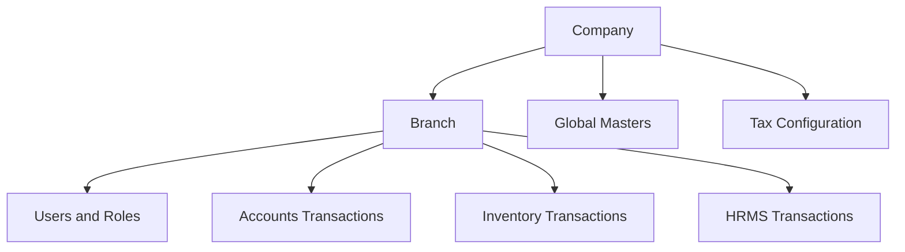
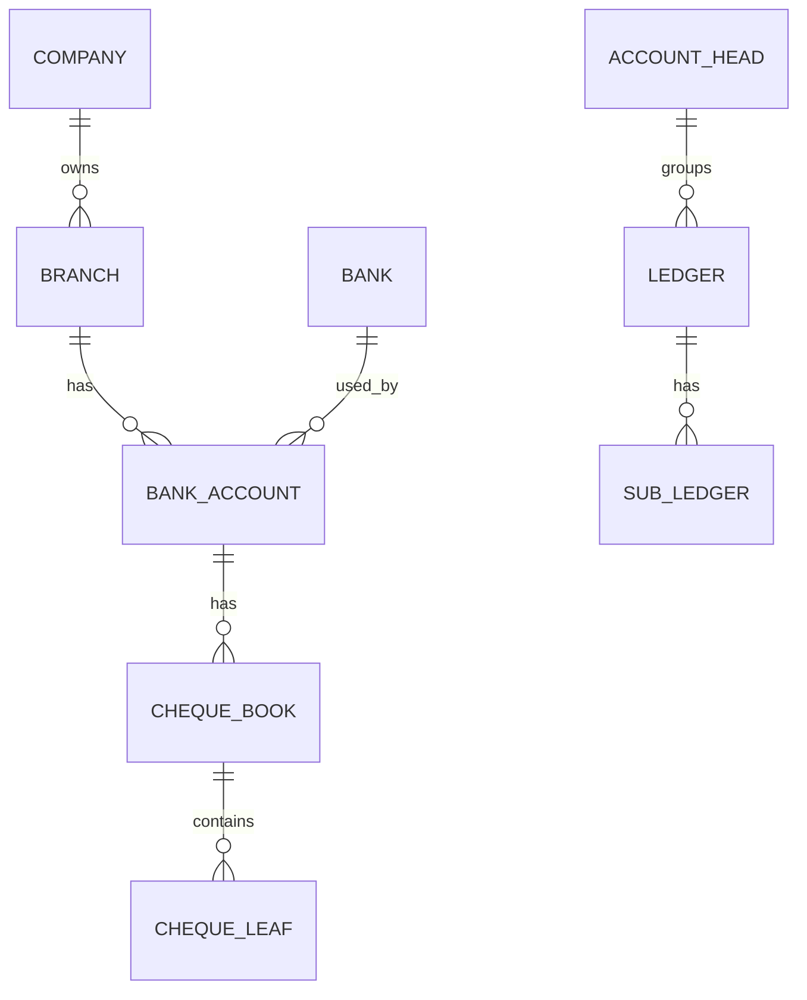
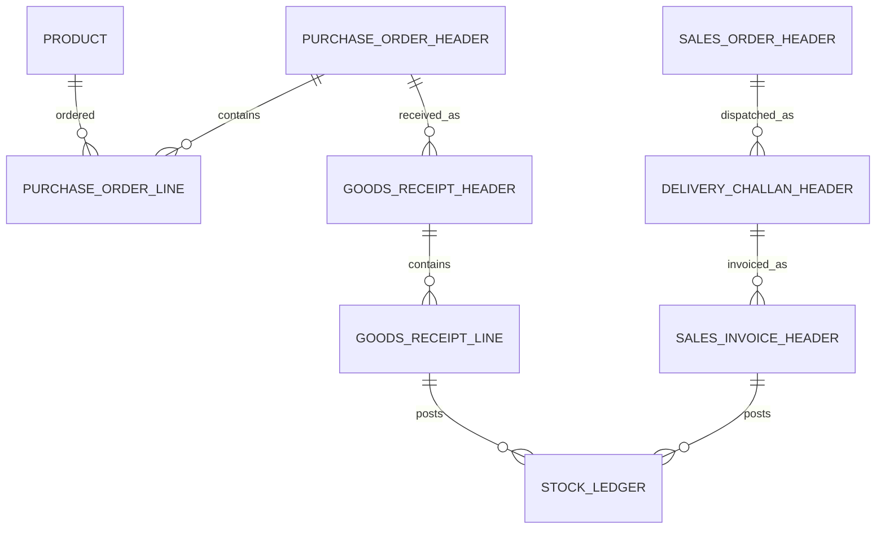

# Database Architecture Document

Document date: 14-May-2026  
Project: Global ERP V21  
Scope: Logical tables, relationships, tenant model, transactions, and reports  
Source: Frontend API calls, route names, payload fields, and business modules

## 1. Purpose

This document defines the logical database architecture for Global ERP based on the inspected Angular frontend. It is not a physical SQL schema because the backend/database source is not available in this workspace.

Before using this as final database documentation, validate table names, primary keys, foreign keys, stored procedures, views, and indexes against the actual database.

## 2. Tenant and Schema Model

Frontend calls consistently pass company, branch, and schema context.

Observed context fields:

| Field | Meaning |
| --- | --- |
| `GlobalSchema` | Shared/global schema context. |
| `BranchSchema` | Branch/accounts/local schema context. |
| `TaxSchema` / `TaxesSchema` | Tax schema context. |
| `CompanyCode` | Selected company code. |
| `BranchCode` | Selected branch code. |
| `branchId` | Selected branch ID from login response. |
| `userId` | Current user ID from login response. |

Logical tenant structure:

Recommended tenant rules:

| Rule | Description |
| --- | --- |
| Every transaction must carry tenant context | Store company ID/code and branch ID/code on all business documents. |
| Branch-specific data must be filterable | Reports and dashboards should filter by branch and company. |
| Global masters must be reusable | Common banks, products, tax codes, and contacts may be shared, but branch-specific overrides must be supported where needed. |
| User rights must include tenant scope | User access should define allowed companies, branches, modules, forms, and actions. |

## 3. Logical Entity Groups

### 3.1 Tenant, Security, and Administration

| Logical table | Purpose | Key relationships |
| --- | --- | --- |
| `Company` | Company/legal entity master. | One company has many branches. |
| `Branch` | Branch/store/unit master. | Belongs to company; owns branch-level transactions. |
| `User` | Login user. | Linked to roles and allowed branches. |
| `Role` | Business role such as admin, finance manager, branch user. | One role has many rights. |
| `UserRole` | User-role assignment. | Links users and roles. |
| `UserBranchAccess` | Company/branch access scope. | Links users to branches. |
| `Module` | ERP module definition. | Accounts, Inventory, HRMS, Settings. |
| `Form` | Screen/form definition. | Used by user-right APIs. |
| `RoleFormRight` | Form access rights. | Create, view, update, delete, approve, export. |
| `UserActivityLog` | User activity/audit trail. | Linked to user, branch, form, and transaction. |

Frontend evidence:

- Company list API returns `tbl_mst_chit_company_configuration_id`, `company_name`, `company_code`.
- Branch list API returns `branch_name`, `branch_code`.
- User rights APIs are present under `/Settings/Users/UserRights`.

### 3.2 Common and Contact Entities

| Logical table | Purpose |
| --- | --- |
| `Contact` | Shared party/person record. |
| `ContactAddress` | Address lines, city, state, country, PIN. |
| `Customer` | Customer-specific profile. |
| `Vendor` | Vendor/supplier-specific profile. |
| `EmployeeContact` | Employee contact profile. |
| `Subscriber` | Subscriber-specific profile where chit/accounting flows apply. |
| `ChannelPartner` | Channel partner details. |
| `Designation` | Common designation master. |

Recommended relationships:

- `Contact` can have many addresses.
- `Customer`, `Vendor`, `EmployeeContact`, `Subscriber`, and `ChannelPartner` can reference `Contact`.
- Transactions should reference the specific party role and the base contact where applicable.

### 3.3 Accounts Masters

| Logical table | Purpose |
| --- | --- |
| `AccountHead` | Chart of accounts node. |
| `Ledger` | Ledger account used in transactions. |
| `SubLedger` | Party/sub-ledger under ledger. |
| `Bank` | Global bank master. |
| `BankAccount` | Company/branch bank account. |
| `BankUPI` | UPI account or UPI configuration. |
| `ChequeBook` | Cheque book range and bank mapping. |
| `ChequeLeaf` | Individual cheque numbers and lifecycle status. |
| `CompanyConfiguration` | Company accounting configuration. |
| `TaxSection` | TDS/GST/tax section setup. |

Suggested relationships:

### 3.4 Accounts Transactions

| Logical table | Purpose |
| --- | --- |
| `GeneralReceiptHeader` | Receipt document header. |
| `GeneralReceiptLine` | Receipt ledger/party allocation lines. |
| `PaymentVoucherHeader` | Payment voucher header. |
| `PaymentVoucherLine` | Payment ledger/party allocation lines. |
| `JournalVoucherHeader` | Journal voucher header. |
| `JournalVoucherLine` | Debit/credit voucher lines. |
| `PettyCashHeader` | Petty cash transaction header. |
| `PettyCashLine` | Petty cash details. |
| `ChequeOnHand` | Received cheques not yet deposited. |
| `ChequeInBank` | Cheques deposited and pending clearance. |
| `ChequeIssued` | Outgoing cheques issued. |
| `ChequeReturn` | Returned cheque details and charges. |
| `ReceiptCancellation` | Receipt cancellation records. |
| `PettyCashCancellation` | Petty cash cancellation records. |
| `BankReconciliation` | BRS header by bank and period. |
| `BankReconciliationLine` | BRS cheque/debit/credit lines. |
| `LedgerPosting` | Normalized ledger impact table if backend uses posting ledger. |

Observed payload/audit fields:

| Field | Purpose |
| --- | --- |
| `pCreatedby` | Created by user ID. |
| `userid` | User ID. |
| `ipaddress` | User/API IP address. |
| `logentrydatetime` | Audit timestamp. |
| `activitytype` | Create/update/cancel activity. |
| `ptypofoperation` / `ptypeofoperation` | Operation type. |
| `receiptid` | Receipt document ID. |
| `receiptnumber` | Receipt document number. |
| `cancellationreason` | Cancellation reason. |

### 3.5 Inventory Masters

| Logical table | Purpose |
| --- | --- |
| `BusinessSegment` | Segment such as electronics, agro, co-working, hotel, etc. |
| `Warehouse` | Warehouse/location master. |
| `BranchStore` | Branch/store setup for inventory operations. |
| `Product` | Product/service master. |
| `ProductCategory` | Product category. |
| `ProductGroup` | Product group. |
| `Brand` | Brand master. |
| `Variant` | Product variant. |
| `Attribute` | Product attributes. |
| `UOM` | Unit of measure. |
| `UOMConversion` | Base and alternate UOM conversion. |
| `HSNSAC` | Tax classification. |
| `BarcodeConfiguration` | Barcode setup. |
| `SerialNumberPolicy` | Serial tracking rules. |
| `BatchLotPolicy` | Batch/lot tracking rules. |
| `VendorMaster` | Supplier master. |
| `CustomerMaster` | Customer master. |
| `PaymentTerms` | Payment terms master. |
| `PriceList` | Price list master. |
| `BOM` | Bill of materials header. |
| `BOMLine` | BOM component lines. |
| `WorkCenter` | Manufacturing work center. |
| `ApprovalWorkflow` | Reusable approval workflow. |
| `ApprovalWorkflowLevel` | Approver levels and escalation. |
| `Transporter` | Transporter master. |
| `Vehicle` | Vehicle master. |

### 3.6 Inventory Transactions

| Logical table | Purpose |
| --- | --- |
| `PurchaseRequisitionHeader` | Internal purchase request. |
| `PurchaseRequisitionLine` | Requested items. |
| `RFQHeader` | Request for quotation. |
| `RFQLine` | RFQ line items. |
| `PurchaseOrderHeader` | Purchase order header. |
| `PurchaseOrderLine` | Purchase order line items. |
| `GoodsReceiptHeader` | GRN header. |
| `GoodsReceiptLine` | Received item lines. |
| `PurchaseReturnHeader` | Purchase return header. |
| `PurchaseReturnLine` | Returned item lines. |
| `SalesEnquiryHeader` | Sales enquiry header. |
| `SalesQuotationHeader` | Sales quotation header. |
| `SalesOrderHeader` | Sales order header. |
| `DeliveryChallanHeader` | Dispatch document header. |
| `SalesInvoiceHeader` | Sales invoice header. |
| `SalesReturnHeader` | Sales return header. |
| `DebitNoteHeader` | Debit note linked to purchase return/difference. |
| `CreditNoteHeader` | Credit note linked to sales return/adjustment. |
| `StockTransferHeader` | Branch/warehouse transfer. |
| `StockTransferLine` | Transfer item lines. |
| `StockAdjustmentHeader` | Adjustment document. |
| `StockAdjustmentLine` | Adjustment item lines. |
| `OpeningStockHeader` | Opening stock document. |
| `OpeningStockLine` | Opening stock item lines. |
| `CycleCountHeader` | Physical count document. |
| `CycleCountLine` | Counted item lines and variance. |
| `ProductionPlanningHeader` | Production plan. |
| `MaterialIssueHeader` | Material issue to production. |
| `ProductionEntryHeader` | Production completion. |
| `ProductionReturnHeader` | Return from production. |
| `ShipmentHeader` | Shipment details. |
| `GatePassHeader` | Inward/outward gate pass. |
| `StockLedger` | Stock movement ledger. |
| `InventoryValuation` | Optional valuation snapshot or movement value table. |

Suggested transaction relationship pattern:

### 3.7 HRMS Entities

| Logical table | Purpose |
| --- | --- |
| `Employee` | Employee master. |
| `EmployeeOnRoll` | On-roll employee details. |
| `Attendance` | Manual attendance entries. |
| `BiometricAttendance` | Biometric attendance import/details. |
| `CalendarYear` | Payroll calendar year. |
| `CalendarMonth` | Payroll month/period. |
| `PayrollProcess` | Payroll batch/process header. |
| `PayrollProcessLine` | Employee salary calculation line. |
| `PayrollApproval` | Payroll approval status. |
| `PayrollJV` | Payroll JV details for accounts. |
| `KHCDetails` | KHC details from HRMS payroll screens. |
| `PolicyDetails` | Policy/employee details observed in HRMS service. |
| `EarnedLeave` | Earned leave calculation/output. |
| `Bonus` | Monthly bonus calculation. |
| `Payslip` | Payslip generation output. |
| `PFStatement` | PF report data. |
| `ESIStatement` | ESI report data. |
| `ProfessionalTax` | Professional tax report data. |

## 4. Header-Line Transaction Pattern

Most ERP transactional documents should follow a header-line model.

| Header fields | Line fields |
| --- | --- |
| Document ID | Line ID |
| Document number | Header ID |
| Document date | Product/ledger/service ID |
| Company and branch | Quantity or amount |
| Party/contact | UOM or debit/credit |
| Status | Tax/discount/rate |
| Created/modified audit | Line status |
| Approval status | Reference document line |

Benefits:

- Supports multiple lines per document.
- Allows partial receipt, partial dispatch, and partial billing.
- Enables drilldown reports.
- Supports cancellation/reversal without deleting original records.

## 5. Status and Approval Model

Recommended status fields:

| Field | Purpose |
| --- | --- |
| `document_status` | Draft, pending, approved, posted, cancelled, closed. |
| `approval_status` | Not required, pending, approved, rejected, escalated. |
| `posting_status` | Not posted, posted, reversed. |
| `reconciliation_status` | Not applicable, pending, reconciled, returned. |
| `is_active` | Master record active/inactive. |

Approval tables:

| Logical table | Purpose |
| --- | --- |
| `ApprovalWorkflow` | Workflow definition by module/form/document. |
| `ApprovalWorkflowLevel` | Level, approver role/user, threshold, escalation. |
| `DocumentApproval` | Approval instance for a transaction. |
| `DocumentApprovalHistory` | Approve/reject/escalate audit trail. |

## 6. Reporting Data Model

Reports can be implemented by views, stored procedures, materialized summary tables, or API-composed queries. The frontend expects report data by company, branch, date range, and selected filters.

| Report group | Likely data sources |
| --- | --- |
| Account Ledger | Ledger postings, voucher lines, party/sub-ledger mappings. |
| Cash Book | Cash ledger postings and receipt/payment documents. |
| Bank Book | Bank ledger postings and bank account mappings. |
| Day Book | All posted vouchers by date. |
| Trial Balance | Account heads, ledger postings, opening balances. |
| BRS | Bank reconciliation header/lines, cheque lifecycle, bank ledger. |
| GST Report | Sales/purchase tax lines, HSN/SAC, GST rates. |
| TDS Report | TDS sections, voucher tax lines, party PAN/TDS details. |
| Stock Summary | Stock ledger aggregation by product/warehouse. |
| Stock Ledger | Stock movement entries. |
| HSN/SAC Summary | Inventory sales/purchase lines plus tax classification. |
| Pending Documents | Open quantities across PR/RFQ/PO/GRN/SO/DC/invoices. |
| Salary Statement | Payroll process lines and employee masters. |
| PF/ESI/PT | Payroll statutory calculation tables. |
| Payslip | Payroll process line plus earnings/deductions. |

## 7. Relationship Summary

| Parent | Child | Relationship |
| --- | --- | --- |
| Company | Branch | One-to-many |
| Company | UserBranchAccess | One-to-many |
| User | UserRole | One-to-many |
| Role | RoleFormRight | One-to-many |
| Branch | Accounts documents | One-to-many |
| Branch | Inventory documents | One-to-many |
| Branch | HRMS documents | One-to-many |
| Contact | Customer/Vendor/Employee | One-to-one or one-to-many by role |
| BankAccount | ChequeBook | One-to-many |
| ChequeBook | ChequeLeaf | One-to-many |
| DocumentHeader | DocumentLine | One-to-many |
| Product | StockLedger | One-to-many |
| Warehouse | StockLedger | One-to-many |
| PayrollProcess | PayrollProcessLine | One-to-many |
| ApprovalWorkflow | ApprovalWorkflowLevel | One-to-many |
| Document | DocumentApprovalHistory | One-to-many |

## 8. Indexing and Performance Recommendations

Recommended indexes for validation with DBA:

| Table type | Suggested indexes |
| --- | --- |
| All transaction headers | `(company_code, branch_code, document_date, document_status)` |
| Document lookup | `(document_no)`, `(company_code, branch_code, document_no)` |
| Ledger postings | `(company_code, branch_code, ledger_id, posting_date)` |
| Stock ledger | `(company_code, branch_code, product_id, warehouse_id, transaction_date)` |
| Cheque tables | `(bank_account_id, cheque_no)`, `(status, transaction_date)` |
| Approval history | `(document_type, document_id, approval_status)` |
| Payroll | `(company_code, branch_code, employee_id, payroll_month)` |
| Reports | Date range plus tenant context fields. |

## 9. Data Integrity Rules

| Rule | Recommendation |
| --- | --- |
| No hard delete for posted documents | Use cancellation/reversal records. |
| Document numbers must be unique per company/branch/document type | Enforce with database constraint. |
| Header and line totals must match | Validate before posting. |
| Stock cannot be posted without product, UOM, warehouse, and branch | Enforce with non-null foreign keys. |
| Tax reporting needs immutable tax rates at transaction time | Store applied rate and tax amount on line. |
| Audit fields must be mandatory | Store created by, created date, modified by, IP, and activity type. |
| Approval history must be append-only | Preserve action history for audit. |

## 10. Database Gaps to Validate

| Area | Open question |
| --- | --- |
| Physical schema names | Are `global`, `accounts`, `taxes`, and branch schemas physical database schemas or logical parameters? |
| Posting architecture | Is there a centralized ledger posting table, or are reports generated from voucher tables? |
| Stock valuation | Which costing method is used: average, FIFO, batch cost, standard cost, or segment-specific? |
| Tenant isolation | Is data separated by schema, company/branch columns, or both? |
| Approval persistence | Are approval workflows stored as reusable masters and instances? |
| Reporting engine | Are reports based on stored procedures, views, API query builders, or tables? |
| Audit | Is there a common audit table for all document changes? |
| Cancellation/reversal | Which documents support reversal, and how are linked postings reversed? |

