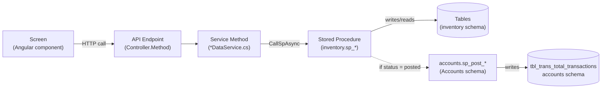
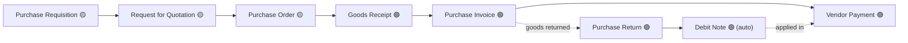
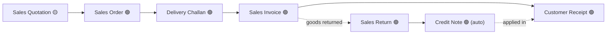

# Inventory Module — Screen-to-Database Developer Map

**Purpose:** a single reference that answers, for any Inventory screen: which frontend file
renders it, which API endpoint it calls, which C# controller/service method handles that
call, which stored procedure does the real work, and which database folder holds that
procedure and its tables. Built for someone new to this codebase who needs to go from "this
screen is showing something wrong" to "this is the exact file to open" without guessing.

This is a **map, not a tutorial** — it doesn't explain business logic (see
`inventory-complete-user-flow.md` for that) or business-flow diagrams; it exists so an edit
lands in the right place on the first try. Keep it updated the way you'd update an index: when
a screen, endpoint, or procedure is added/renamed/moved, update its one row here.

---

## How to read every row

```
Frontend root  : OneSphere-Inventory/src/app/inventory/
Backend root   : GLOBAL_ACCOUNTS_LATEST/Kapil_Group_ERP_API/
Schema root    : GLOBAL_ACCOUNTS_LATEST/Kapil_Group_ERP_API/Database/Schema/
```

All paths in the tables below are **relative to the root shown above them**. A "Schema
Folder" cell is the entity's base folder — open it and you'll find its `Procedures/`,
`Tables/`, and sometimes `Functions/` subfolders side by side. That folder tree is not
hand-filed — it's a generated mirror of the live database (see
`Tools/schema-export/export-schema.ps1`), so trust it over any older written description of
the schema, this doc included.



Almost every screen in this module is a thin wrapper around one shared component,
`Inventory_Shared/inventory-screen-shell/inventory-screen-shell.ts`, driven by a config
object from `Inventory_Shared/inventory-screen.model.ts`. If a screen's own `.ts` file is
only 15–20 lines, that's expected — the real logic lives in the shell, and the config object
is what tells the shell which endpoint to call.

**Status column key:** 🟢 Live (real backend, reachable) · 🟡 Wired, hidden (real backend,
menu currently disabled) · 🔴 Dead (no route/menu entry at all) · ⚪ Mock (no backend). Full
detail on this in `inventory-complete-user-flow.md` §9 — not repeated here to keep this doc
purely a path map.

---

## Dashboard

| Screen | Frontend | Endpoint | Controller → Service | Stored Procedure | Schema Folder |
|---|---|---|---|---|---|
| Inventory Summary Dashboard 🟢 | `Inventory_Shared/*` (dashboard widgets, not a single screen file) | `GET /api/inventory/dashboard/summary` | `InventoryTransactionsController.GetDashboardSummary` → `GetDashboardSummaryAsync` | `inventory.sp_get_dashboard_summary` | `Inventory/Reports/Dashboard/` |
| — Sales-without-PI flag | | `GET /api/inventory/dashboard/sales-without-pi` | `GetSalesPiPendingFlags` → `GetSalesPiPendingFlagsAsync` | `inventory.sp_get_sales_pi_pending_flags` | `Inventory/Transactions/SalesInvoice/` |
| — DC-pending-invoice flag | | `GET /api/inventory/dashboard/dc-pending-invoice` | `GetDcPendingInvoiceLines` → `GetDcPendingInvoiceLinesAsync` | `inventory.sp_get_dc_pending_invoice_lines` | `Inventory/Transactions/DeliveryChallan/` |
| — Loss-sales flag | | `GET /api/inventory/dashboard/loss-sales` | `GetLossSalesFlags` → `GetLossSalesFlagsAsync` | `inventory.sp_get_loss_sales_flags` | `Inventory/Reports/InventorySummary/` |

## Configuration

| Screen | Frontend | Endpoint | Controller → Service | Stored Procedure(s) | Schema Folder |
|---|---|---|---|---|---|
| Business Segments 🟢 | `Inventory_Config/business-segments/business-segments.ts` | `GET/POST/PUT .../segments[/{id}]`, `POST .../segments/batch` | `InventoryConfigController.Get/Create/UpdateSegment`, `BatchSaveSegments` → `InventoryDataService` | `sp_get/upsert_segment`, `sp_batch_save_segments` | `Inventory/Configuration/BusinessSegments/` |
| Warehouse Setup 🟢 | `Inventory_Config/warehouse-location-master/warehouse-location-master.ts` | `GET/POST/PUT .../warehouses[/{id}]`, `POST .../warehouses/batch`, `.../locations[/{id}]` | `InventoryConfigController.Get/Create/UpdateWarehouse`, `BatchSaveWarehouses`, `Get/Create/UpdateLocation` | `sp_get/upsert_warehouse`, `sp_batch_save_warehouses`, `sp_get/upsert_location` | `Inventory/Configuration/WarehouseLocationMaster/` |
| Branch / Store Setup 🟢 | `Inventory_Config/branch-master/branch-master.ts` | `GET/POST/PUT .../branches[/{id}]`, `POST .../branches/batch` | `InventoryConfigController.Get/Create/UpdateBranchInv`, `BatchSaveBranchesInv` | `sp_get/upsert_branch_inv`, `sp_batch_save_branches_inv` | `Inventory/Configuration/BranchMaster/` |
| HSN/SAC Tax Code Import 🟢 | `Inventory_Config/tax-code-import/tax-code-import.ts` | `GET/POST/PUT .../hsnsac[/{id}]`, `POST .../hsnsac/quick` | `InventoryConfigController.Get/Create/UpdateHsnSac`, `QuickAddHsnSac` | `sp_get/upsert_hsn_sac`, `sp_quick_add_hsn_sac` | `Inventory/Masters/HsnSacMapping/` |
| Import Data *(not in sidebar, reached via breadcrumb button)* 🟢 | `Inventory_Config/import-data/import-data.ts` | *(varies by target master — reuses that master's own save endpoint)* | — | — | — |

## Masters — Product Config group

| Screen | Frontend | Endpoint | Service Method | Stored Procedure(s) | Schema Folder |
|---|---|---|---|---|---|
| Product Master 🟢 | `Inventory_Masters/product-service-master/product-service-master.ts` | `GET/POST/PUT .../products[/{id}]` | `GetProductsAsync` / `UpsertProductAsync` | `sp_get/upsert_product` | `Inventory/Masters/ProductServiceMaster/` |
| Product Nature Master 🟢 | `Inventory_Masters/product-type-master/product-type-master.ts` | `GET/POST/PUT/DELETE .../product-types[/{id}]` | `Get/Upsert/DeleteProductTypeAsync` | `sp_get/upsert/delete_product_type` | `Inventory/Masters/ProductTypeMaster/` |
| Product Category 🟢 | `Inventory_Masters/category-master/category-master.ts` | `GET/POST/PUT .../categories[/{id}]`, `POST .../categories/quick` | `Get/UpsertCategoryAsync`, `QuickAddCategoryAsync` | `sp_get/upsert_category`, `sp_quick_add_category` | `Inventory/Masters/CategoryMaster/` |
| Brand Master 🟢 | `Inventory_Masters/brand-master/brand-master.ts` | `GET/POST/PUT .../brands[/{id}]` | `Get/UpsertBrandAsync` | `sp_get/upsert_brand` | `Inventory/Masters/BrandMaster/` |
| Variant Master 🟢 | `Inventory_Masters/variant-master/variant-master.ts` | `GET/POST/PUT .../variants[/{id}]`, `POST .../variants/generate-combinations` | `Get/UpsertVariantAsync`, `GenerateVariantCombinationsAsync` | `sp_get/upsert_variant`, `sp_generate_variant_combinations` | `Inventory/Masters/VariantMaster/` |
| Attribute Master 🟢 | `Inventory_Masters/attribute-master/attribute-master.ts` | `GET/POST/PUT .../attributes[/{id}]`, `POST .../attribute-variants/bulk-import` | `Get/UpsertAttributeAsync`, `BulkImportAttributeVariantsAsync` | `sp_get/upsert_attribute`, `sp_bulk_import_attribute_variants` | `Inventory/Masters/AttributeMaster/` |
| UOM Master 🟢 | `Inventory_Masters/uom-master/uom-master.ts` | `GET/POST/PUT .../uom[/{id}]`, `POST .../uom/quick`, `POST products/{id}/uom-convert` | `Get/UpsertUomAsync`, `QuickAddUomAsync`, `ConvertProductUomAsync` | `sp_get/upsert_uom`, `sp_quick_add_uom`, `fn_convert_uom` | `Inventory/Masters/UomMaster/` |
| Tax Classification Master 🟢 | `Inventory_Masters/hsn-sac-mapping/hsn-sac-mapping.ts` | *(shares HSN/SAC endpoints above)* | | | `Inventory/Masters/HsnSacMapping/` |
| Barcode Configuration 🟢 | `Inventory_Masters/barcode-configuration/barcode-configuration.ts` | `GET/POST/PUT .../barcode-configurations[/{id}]` | `Get/UpsertBarcodeConfigurationAsync` | `sp_get/upsert_barcode_configuration` | `Inventory/Masters/BarcodeConfiguration/` |
| Serial Number Policy 🟢 | `Inventory_Masters/serial-number-policy/serial-number-policy.ts` | `GET/POST/PUT .../serial-policies[/{id}]` | `Get/UpsertSerialPolicyAsync` | `sp_get/upsert_serial_policy` | `Inventory/Masters/SerialNumberPolicy/` |
| Batch / Lot Policy 🟢 | `Inventory_Masters/batch-lot-policy/batch-lot-policy.ts` | `GET/POST/PUT .../batch-policies[/{id}]` | `Get/UpsertBatchPolicyAsync` | `sp_get/upsert_batch_policy` | `Inventory/Masters/BatchLotPolicy/` |

## Masters — Party & Commercial group

| Screen | Frontend | Endpoint | Service Method | Stored Procedure(s) | Schema Folder |
|---|---|---|---|---|---|
| Vendor Master 🟢 | `Inventory_Masters/vendor-master/vendor-master.ts` | `GET/POST/PUT .../vendors[/{id}]` | `Get/UpsertVendorAsync` | `sp_get/upsert_vendor` | `Inventory/Masters/VendorMaster/` |
| Customer Master 🟢 | `Inventory_Masters/customer-master/customer-master.ts` | `GET/POST/PUT .../customers[/{id}]` | `Get/UpsertCustomerAsync` | `sp_get/upsert_customer` | `Inventory/Masters/CustomerMaster/` |
| Channel Partner Master 🟢 | `Inventory_Masters/channel-partner-master/channel-partner-master.ts` | `GET/POST/PUT .../channel-partners[/{id}]` | `Get/UpsertChannelPartnerAsync` | `sp_get/upsert_channel_partner` | `Inventory/Masters/ChannelPartnerMaster/` |
| Payment Terms Master 🟢 | `Inventory_Masters/payment-terms-master/payment-terms-master.ts` | `GET/POST/PUT .../payment-terms[/{id}]` | `Get/UpsertPaymentTermAsync` | `sp_get/upsert_payment_term` | `Inventory/Masters/PaymentTermsMaster/` |
| Price List Master 🟢 *(real backend since migration 219)* | `Inventory_Masters/price-list-master/price-list-master.ts` | `GET/POST/PUT/DELETE .../price-lists[/{id}]` | `Get/Upsert/DeletePriceListAsync` | `sp_get/upsert/delete_price_list` | ⚠️ not yet mirrored — see gap note below |

## Masters — Manufacturing group

| Screen | Frontend | Endpoint | Service Method | Stored Procedure(s) | Schema Folder |
|---|---|---|---|---|---|
| BOM Master 🟢 *(real backend since migration 219)* | `Inventory_Masters/bom-master/bom-master.ts` | `GET/POST/PUT/DELETE .../boms[/{id}]` | `Get/Upsert/DeleteBomAsync` | `sp_get/upsert/delete_bom` | ⚠️ not yet mirrored — see gap note below |
| Work Center Master 🟢 *(real backend since migration 219)* | `Inventory_Masters/work-center-master/work-center-master.ts` | `GET/POST/PUT/DELETE .../work-centers[/{id}]` | `Get/Upsert/DeleteWorkCenterAsync` | `sp_get/upsert/delete_work_center` | ⚠️ not yet mirrored — see gap note below |

## Masters — Operations / Logistics groups

| Screen | Frontend | Endpoint | Service Method | Stored Procedure(s) | Schema Folder |
|---|---|---|---|---|---|
| Consumption Type Master 🟡 | `Inventory_Masters/consumption-type-master/consumption-type-master.ts` | `GET/POST/PUT .../consumption-types[/{id}]` | `Get/UpsertConsumptionTypeAsync` | `sp_get/upsert_consumption_type` | `Inventory/Masters/ConsumptionTypeMaster/` |
| Approval Workflow Master 🔴 | `Inventory_Masters/approval-workflow-master/approval-workflow-master.ts` | *(no backend endpoint)* | — | — | — |
| Transporter Master 🔴 | `Inventory_Masters/transporter-master/transporter-master.ts` | *(no backend endpoint)* | — | — | — |
| Vehicle Master 🔴 | `Inventory_Masters/vehicle-master/vehicle-master.ts` | *(no backend endpoint)* | — | — | — |

## Masters — Orphaned / mock (no menu entry)

| Screen | Frontend | Endpoint | Service Method | Stored Procedure(s) | Schema Folder |
|---|---|---|---|---|---|
| Product Group Master 🟢 *(orphaned — no sidebar entry)* | `Inventory_Masters/product-group-master/product-group-master.ts` | `GET/POST/PUT .../product-groups[/{id}]` | `Get/UpsertProductGroupAsync` | `sp_get/upsert_product_group` | `Inventory/Masters/ProductGroupMaster/` |
| Opening Inventory Balance ⚪ *(the one true mock — no menu entry)* | `Inventory_Masters/opening-inventory-balance/opening-inventory-balance.ts` | *(none — browser-only)* | — | — | — |
| Substitute Products 🟢 *(route redirects to Product Master)* | `Inventory_Masters/substitute-products/substitute-products.ts` | `GET/POST/PUT .../substitute-products[/{id}]` | `Get/UpsertSubstituteProductAsync` | `sp_get/upsert_substitute_product` | `Inventory/Masters/SubstituteProducts/` |

## Transactions — Payments & Receipts

| Screen | Frontend | Endpoint | Service Method | Stored Procedure(s) | Schema Folder |
|---|---|---|---|---|---|
| Vendor Payment 🟢 *(bespoke, not the shared shell)* | `Inventory_Transactions/payment-receipt-voucher/payment-receipt-voucher.ts` (route `data: {mode:'pay'}`) | `inventory.sp_get/save_payment_voucher` via `PaymentsController` | `IInventoryTransactionsDataService` payment methods | `sp_get/save_payment_voucher` + (posted) `accounts.sp_post_payment_voucher` | `Inventory/Transactions/VendorPayment/`; `Accounts/InventoryPosting/Postings/` |
| Customer Receipt 🟢 *(same component, mode='receipt')* | `Inventory_Transactions/payment-receipt-voucher/payment-receipt-voucher.ts` | `inventory.sp_get_receipt_vouchers` (mirror of above) | | + (posted) `accounts.sp_post_receipt_voucher` | `Inventory/Transactions/VendorPayment/`; `Accounts/InventoryPosting/Postings/` |

## Transactions — Procurement

| Screen | Frontend | Endpoint | Service Method | Stored Procedure(s) | Schema Folder |
|---|---|---|---|---|---|
| Purchase Requisition 🟡 | `Inventory_Transactions/purchase-requisition/purchase-requisition.ts` | `GET/POST/PUT .../purchase-requisitions[/{id}]` | `Get/SavePurchaseRequisitionAsync` | `sp_get/save_purchase_requisition` | `Inventory/Transactions/PurchaseRequisition/` |
| Request for Quotation 🟡 | `Inventory_Transactions/request-for-quotation/request-for-quotation.ts` | `GET/POST/PUT .../rfq[/{id}]` | `Get/SaveRfqAsync` | `sp_get/save_rfq` | `Inventory/Transactions/RequestForQuotation/` |
| Purchase Order 🟡 | `Inventory_Transactions/purchase-order/purchase-order.ts` | `GET/POST/PUT .../purchase-orders[/{id}]` | `Get/SavePurchaseOrderAsync` | `sp_get/save_purchase_order` | `Inventory/Transactions/PurchaseOrder/` |
| Goods Receipt (GRN) 🟢 | `Inventory_Transactions/goods-receipt/goods-receipt.ts` | `GET/POST/PUT .../grn[/{id}]` | `Get/SaveGrnAsync` | `sp_get/save_grn` | `Inventory/Transactions/GoodsReceipt/` |
| Purchase Invoice 🟢 | `Inventory_Transactions/purchase-invoice/purchase-invoice.ts` (+ `purchase-invoice-attachments.component.ts`) | `GET/POST/PUT .../purchase-invoices[/{id}]`, `.../attachments*` | `SavePurchaseInvoiceAsync` | `sp_save_purchase_invoice` + (posted) `accounts.sp_post_purchase_invoice` | `Inventory/Transactions/PurchaseInvoice/`; `Accounts/InventoryPosting/Postings/` |
| Purchase Return 🟢 | `Inventory_Transactions/purchase-return/purchase-return.ts` | `GET/POST/PUT .../purchase-returns[/{id}]` | `SavePurchaseReturnAsync` | `sp_save_purchase_return` + (posted) `accounts.sp_reverse_purchase_invoice_posting` | `Inventory/Transactions/PurchaseReturn/`; `Accounts/InventoryPosting/Postings/` |
| Debit Note 🟢 | `Inventory_Transactions/debit-note/debit-note.ts` | `GET/POST/PUT .../purchase-debit-notes[/{id}]` | `Get/SaveDebitNoteAsync` | `sp_get/save_debit_note` | `Inventory/Transactions/DebitNote/` |

## Transactions — Sales

| Screen | Frontend | Endpoint | Service Method | Stored Procedure(s) | Schema Folder |
|---|---|---|---|---|---|
| Sales Enquiry 🔴 | `Inventory_Transactions/sales-enquiry/sales-enquiry.ts` | `GET/POST/PUT .../estimations[/{id}]` | `Get/SaveEstimationAsync` (`SalesTransactionsController`) | `sp_get/save_estimation` | `Inventory/Transactions/SalesEnquiry/` |
| Sales Quotation 🟡 | `Inventory_Transactions/sales-quotation/sales-quotation.ts` | `GET/POST/PUT .../quotations[/{id}]` | `Get/SaveSalesQuotationAsync` | `sp_get/save_sales_quotation` | `Inventory/Transactions/SalesQuotation/` |
| Sales Order 🟢 | `Inventory_Transactions/sales-order/sales-order.ts` | `GET/POST/PUT .../orders[/{id}]` | `Get/SaveSalesOrderAsync` | `sp_get/save_sales_order` | `Inventory/Transactions/SalesOrder/` |
| Delivery Challan 🟢 | `Inventory_Transactions/delivery-challan/delivery-challan.ts` | `GET/POST/PUT .../delivery-challans[/{id}]`, `POST .../close` | `Get/SaveDeliveryChallanAsync`, `CloseDeliveryChallanAsync` | `sp_get/save_delivery_challan`, `sp_close_delivery_challan` | `Inventory/Transactions/DeliveryChallan/` |
| Sales Invoice 🟢 | `Inventory_Transactions/sales-invoice/sales-invoice.ts` | `GET/POST/PUT .../invoices[/{id}]` | `SaveSalesInvoiceAsync` | `sp_save_sales_invoice` + (posted) `accounts.sp_post_sales_invoice` | `Inventory/Transactions/SalesInvoice/`; `Accounts/InventoryPosting/Postings/` |
| Sales Return 🟢 | `Inventory_Transactions/sales-return/sales-return.ts` | `GET/POST/PUT .../sales-returns[/{id}]` | `SaveSalesReturnAsync` | `sp_save_sales_return` + (posted) `accounts.sp_reverse_sales_invoice_posting` | `Inventory/Transactions/SalesReturn/`; `Accounts/InventoryPosting/Postings/` |
| Credit Note 🟢 | `Inventory_Transactions/credit-note/credit-note.ts` | `GET/POST/PUT .../credit-notes[/{id}]` | `Get/SaveCreditNoteAsync` | `sp_get/save_credit_note` | `Inventory/Transactions/CreditNote/` |
| Estimation 🔴 *(no route/menu — dead)* | `Inventory_Transactions/estimation/estimation.ts` | `GET/POST/PUT .../estimations[/{id}]` | `Get/SaveEstimationAsync` | `sp_get/save_estimation` | `Inventory/Transactions/SalesEnquiry/` |
| Proforma Invoice 🔴 *(no route/menu — dead)* | `Inventory_Transactions/proforma-invoice/proforma-invoice.ts` | `GET/POST/PUT .../proforma-invoices[/{id}]` | `Get/SaveProformaInvoiceAsync` | `sp_get/save_proforma_invoice` | `Inventory/Transactions/SalesInvoice/` |
| POS Billing 🔴 *(no route/menu — dead)* | `Inventory_Transactions/pos-billing/pos-billing.ts` | *(none found)* | — | — | — |

## Transactions — Stock

| Screen | Frontend | Endpoint | Service Method | Stored Procedure(s) | Schema Folder |
|---|---|---|---|---|---|
| Stock Transfer 🟢 | `Inventory_Transactions/stock-transfer/stock-transfer.ts` | `GET/POST/PUT .../stock-transfers[/{id}]` | `SaveStockTransferAsync` | `sp_save_stock_transfer` + (posted) `accounts.sp_post_stock_transfer` | `Inventory/Transactions/StockTransfer/`; `Accounts/InventoryPosting/Postings/` |
| Stock Adjustment 🟢 *(posts on pending_approval→approved, not draft→posted; ⚠️ never calls an accounts.sp_post_* — see note)* | `Inventory_Transactions/stock-adjustment/stock-adjustment.ts` | `GET/POST/PUT .../stock-adjustments[/{id}]` | `SaveStockAdjustmentAsync` | `sp_save_stock_adjustment` (no accounts-side call) | `Inventory/Transactions/StockAdjustment/` |
| Opening Stock Entry 🟢 | `Inventory_Transactions/opening-stock-entry/opening-stock-entry.ts` | `GET/POST/PUT .../opening-stock-entries[/{id}]` | `SaveOpeningStockEntryAsync` | `sp_save_opening_stock_entry` (no accounts-side call from this path — see note) | `Inventory/Transactions/OpeningStockEntry/` |
| Cycle Count 🟡 | `Inventory_Transactions/cycle-count/cycle-count.ts` | `GET/POST/PUT .../cycle-counts[/{id}]` | `Get/SaveCycleCountAsync` | `sp_get/save_cycle_count` | `Inventory/Transactions/CycleCount/` |

> ⚠️ **Known gap (verified 2026-09-24):** `SaveStockAdjustmentAsync` and `SaveOpeningStockEntryAsync` never call an `accounts.sp_post_*` procedure — checked both the C# service and the SQL procedure bodies directly, zero references to the `accounts` schema in either. Every other posting-capable transaction in this table does call one. A separate procedure, `accounts.sp_post_opening_inventory` (`Accounts/InventoryPosting/Postings/sp_post_opening_inventory.sql`), exists in the schema but is **not called from this save path** — worth checking whether it's used elsewhere (e.g. a backfill script) before assuming it's dead.

## Transactions — Manufacturing

| Screen | Frontend | Endpoint | Service Method | Stored Procedure(s) | Schema Folder |
|---|---|---|---|---|---|
| Production Planning 🟢 | `Inventory_Transactions/production-planning/production-planning.ts` | `GET/POST/PUT .../production-plans[/{id}]` | `Get/SaveProductionPlanAsync` | `sp_get/save_production_plan` | `Inventory/Transactions/ProductionPlanning/` |
| Material Issue for Production 🟢 | `Inventory_Transactions/material-issue-production/material-issue-production.ts` | `GET/POST/PUT .../material-issues-production[/{id}]` | `SaveMaterialIssueProductionAsync` | `sp_save_material_issue_production` + (posted) `accounts.sp_post_material_issue_production` | `Inventory/Transactions/MaterialIssueProduction/`; `Accounts/InventoryPosting/Postings/` |
| Production Entry 🟢 | `Inventory_Transactions/production-entry/production-entry.ts` | `GET/POST/PUT .../production-entries[/{id}]` | `SaveProductionEntryAsync` | `sp_save_production_entry` + (posted) `accounts.sp_post_production_entry` | `Inventory/Transactions/ProductionEntry/`; `Accounts/InventoryPosting/Postings/` |
| Production Return 🟢 | `Inventory_Transactions/production-return/production-return.ts` | `GET/POST/PUT .../production-returns[/{id}]` | `SaveProductionReturnAsync` | `sp_save_production_return` + (posted) `accounts.sp_post_production_return` | `Inventory/Transactions/ProductionReturn/`; `Accounts/InventoryPosting/Postings/` |

## Transactions — Consumption / Logistics (dead — no backend)

| Screen | Frontend | Endpoint | Notes |
|---|---|---|---|
| Material Consumption 🔴 | `Inventory_Transactions/material-consumption/material-consumption.ts` | none | |
| Internal Issue Slip 🔴 | `Inventory_Transactions/internal-issue-slip/internal-issue-slip.ts` | none | |
| Shipment Entry 🔴 | `Inventory_Transactions/shipment-entry/shipment-entry.ts` | none | |
| Gate Pass 🔴 | `Inventory_Transactions/gate-pass/gate-pass.ts` | none | Not to be confused with **Transport/Gate Pass Details**, the real, working sub-feature attached to PI/SI — see below |

## Shared sub-features (not standalone screens)

| Feature | Frontend | Endpoint | Service Method | Stored Procedure(s) | Schema Folder |
|---|---|---|---|---|---|
| Transport / Gate Pass Details 🟢 (attaches to PI, SI, etc.) | `Inventory_Shared/inventory-transport-details/inventory-transport-details.component.ts` | `GET/POST .../transport-details` | `Get/SaveTransportDetailsAsync` | `sp_get/save_transport_details` | `Inventory/Masters/TransporterMaster/` |
| Serial number lookups (available/reserved/sold/duplicate-check) | `Inventory_Shared/inventory-serial-picker-modal/` | `GET .../serials/*` | `SalesTransactionsService` serial methods | `sp_get_available_serials` + siblings | `Inventory/Masters/SerialNumberPolicy/` |
| Available stock lookup | (used across PI/SI/DC/Transfer forms) | `GET .../available-stock` | `GetAvailableStockAsync` | `sp_get_available_stock` | `Inventory/_Shared/Stock/` |
| Reference document picker (PR→RFQ→PO→GRN→PI, SO→DC→SI, returns) | (built into the shell) | `GET .../ref-docs` | `GetRefDocsAsync` | `sp_get_sales_docs_for_ref` / `sp_get_purchase_docs_for_ref` | `Inventory/_Shared/DocumentLifecycle/` |
| Next document number | (built into the shell) | `GET .../next-doc-number` | `PeekNextDocNumberAsync` | `fn_peek_sales_doc_number` | ⚠️ not yet mirrored — see gap note below |
| Cancel document (purchase-side / sales-side) | (built into the shell) | `POST .../cancel` | `Cancel...DocAsync` | `sp_cancel_purchase_doc` / `sp_cancel_sales_doc` | `Inventory/_Shared/DocumentLifecycle/` |

## Reports

All 17 reports run through one generic component, driven by a registry — not one file per
report.

| Component | Frontend | Notes |
|---|---|---|
| Report shell | `Inventory_Reports/report-page/inventory-report-page.ts` | Renders any report by key |
| Report registry (all 15 sidebar reports' endpoints) | `Inventory_Reports/shared/inventory-report.registry.ts` | Look here for a specific report's `endpoint` value |
| Report HTTP client | `Inventory_Reports/shared/inventory-reports.service.ts` | Calls `GET /api/reports/{endpoint}` |
| Stock Valuation Comparison 🟡 *(not in sidebar)* | `Inventory_Reports/stock-valuation-comparison/stock-valuation-comparison.ts` | Bespoke static route | `Inventory/Reports/StockValuationComparison/` |
| MIS Report 🟡 *(not in sidebar, admin-only)* | `Inventory_Reports/mis-report/mis-report.ts` | Bespoke static route | `Inventory/Reports/MisReport/` |
| Legacy report components *(dead code — not referenced by routes)* | `hsn-sac-report/`, `segment-summary/`, `stock-availability-report/`, `stock-ledger/` | Superseded by the generic report-page + registry above |

All 15 sidebar reports are 🟡 **wired, hidden** — real backends, entire Reports menu
currently disabled (this was flipped on for the copy of this app you're reading against on
2026-09-24 — check `navigation.service.ts` if that's since changed).

---

## Document lifecycle flows

### Procurement



### Sales



---

## Known schema-mirror gaps (as of 2026-09-25)

These stored procedures exist and work in the live database but have **no file yet** under
`Database/Schema/` — the folder hasn't been regenerated since migrations 219/230 shipped.
Running `Tools/schema-export/export-schema.ps1` resolves all four automatically; nothing to
hand-fix.

- `inventory.sp_get/upsert/delete_work_center` — Work Center Master
- `inventory.sp_get/upsert/delete_price_list` — Price List Master
- `inventory.sp_get/upsert/delete_bom` — BOM Master
- `inventory.fn_peek_sales_doc_number` — Next document number

## Companion docs

- `inventory-complete-user-flow.md` — the business-flow narrative and full screen
  reachability table (Live/Wired-hidden/Dead/Mock), one level up from this doc.
- `GLOBAL_ACCOUNTS_LATEST/Kapil_Group_ERP_API/Docs/inventory-controllers-to-schema-mapping.md`
  — the backend-only version of this map (every controller endpoint, no frontend paths).
