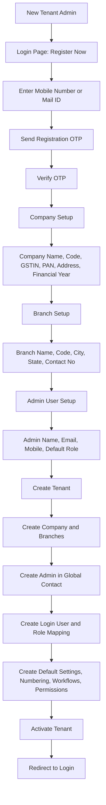
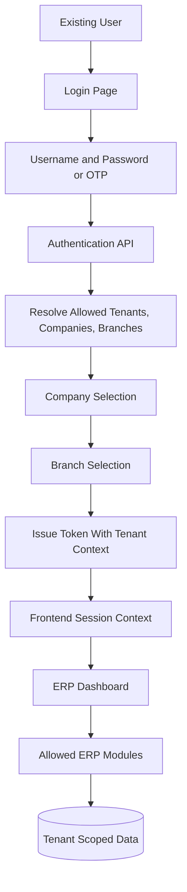
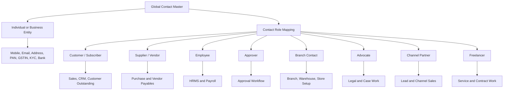

# Software Architecture Document

Project: SaaS-Based ERP Application  
Document date: 14-May-2026  
Audience: Developers, business analysts, project managers, product owners, implementation teams, support teams, and business stakeholders  
Document type: Software Architecture Document

## 1. Introduction

This document describes the proposed software architecture for a SaaS-based Enterprise Resource Planning application. The ERP platform is designed to support multiple companies, branches, users, departments, and business processes through a secure, scalable, configurable, and modular architecture.

The document covers business modules, technical architecture, multi-tenant design, database structure, APIs, UI, security, deployment, reporting, audit, workflow, integrations, and future enhancements.

## 2. Application Overview

The SaaS ERP application provides a centralized business management platform for organizations that need to manage company setup, branches, users, roles, inventory, purchase, sales, accounts, HRMS, payroll, CRM, dashboards, reports, and system settings.

The application is delivered as a web-based SaaS product. Users access the system through a browser. Each tenant can manage its own companies, branches, users, permissions, masters, transactions, workflows, reports, and integrations.

Text architecture overview:

```text
Users
  |
  v
Web / Mobile Browser
  |
  v
Frontend Application
  |
  v
API Gateway / Backend API
  |
  +--> Authentication and Authorization
  +--> Business Modules
  +--> Approval Workflow
  +--> Reporting Engine
  +--> Integration Services
  |
  v
Database / Cache / File Storage / Audit Logs
```

## 3. Business Objectives

| Objective | Description |
| --- | --- |
| Centralized business operations | Provide one platform for finance, inventory, purchase, sales, HR, payroll, CRM, and reporting. |
| Multi-company and multi-branch support | Allow tenants to manage multiple companies, branches, warehouses, stores, and departments. |
| SaaS scalability | Support many tenants using shared infrastructure with strong data isolation. |
| Role-based control | Give users only the access they need based on role, branch, company, and workflow responsibility. |
| Process automation | Reduce manual work through document flows, approvals, notifications, integrations, and reports. |
| Compliance support | Support GST, e-invoice, e-way bill, TDS, payroll statutory reports, audit logs, and document history. |
| Real-time visibility | Provide dashboards and reports for management, operations, finance, sales, HR, and audit teams. |
| Integration readiness | Connect with government systems, payment gateways, WhatsApp, email, SMS, accounting services, and external APIs. |

## 4. Module List

| Module | Main purpose |
| --- | --- |
| Company Setup | Configure tenant companies, legal details, tax registration, financial year, logo, and statutory information. |
| Branch Management | Manage branches, stores, warehouses, locations, departments, and branch-specific settings. |
| User and Role Management | Manage users, roles, permissions, access scope, password policy, and user activity. |
| Inventory | Manage products, services, categories, UOM, stock, warehouses, batches, serial numbers, and stock valuation. |
| Purchase | Manage purchase requisition, RFQ, purchase order, goods receipt, purchase invoice, and purchase return. |
| Sales | Manage enquiry, quotation, sales order, delivery challan, sales invoice, sales return, and credit note. |
| Accounts | Manage ledgers, vouchers, receipts, payments, journal entries, bank, cash, GST, TDS, and reconciliation. |
| HRMS | Manage employee records, attendance, leave, shift, biometric data, and HR documents. |
| Payroll | Manage salary processing, earnings, deductions, statutory calculations, payslips, and payroll approvals. |
| CRM | Manage leads, customers, opportunities, follow-ups, campaigns, and customer communication. |
| Dashboard | Show KPIs, alerts, approvals, pending documents, sales, cash flow, stock, HR, and operational metrics. |
| Reports | Provide financial, inventory, purchase, sales, HRMS, payroll, CRM, audit, and statutory reports. |
| Settings | Configure system preferences, numbering, notifications, integrations, workflows, tax settings, and templates. |

## 5. High-Level Architecture

The application uses a layered architecture with a clear separation between presentation, API, business logic, data access, database, and integration layers.

```text
Presentation Layer
  - Web UI
  - Mobile responsive UI
  - Dashboards
  - Reports

API Layer
  - REST APIs
  - Authentication middleware
  - Authorization middleware
  - Validation middleware
  - Rate limiting

Business Layer
  - ERP modules
  - Approval workflow
  - Document numbering
  - Posting logic
  - Notifications

Data Access Layer
  - Repositories
  - Query services
  - Transaction management

Data Layer
  - Tenant data
  - Master data
  - Transaction data
  - Reports
  - Audit logs

Integration Layer
  - GST
  - E-Invoice
  - E-Way Bill
  - WhatsApp
  - Email
  - Payment Gateway
```

## 6. SaaS Multi-Tenant Architecture

The ERP is designed as a SaaS platform where multiple tenants share the same application while their data and configuration remain isolated.

The current project has a simple Register / OTP demo flow on the login page. This flow is not fully connected to backend tenant provisioning yet, but it should be treated as the planned onboarding design for new SaaS tenants.

### 6.1 Tenant Model

| Level | Description |
| --- | --- |
| Tenant | Customer organization using the SaaS ERP. |
| Company | Legal entity under a tenant. |
| Branch | Operating unit, store, warehouse, office, project, or location. |
| Department | Functional group such as Accounts, HR, Sales, Purchase, or Warehouse. |
| User | Person who logs in and performs actions. |
| Role | Permission group assigned to users. |

Tenant hierarchy:

```text
Tenant
  |
  +-- Company 1
  |     |
  |     +-- Branch 1
  |     +-- Branch 2
  |
  +-- Company 2
        |
        +-- Branch 1
        +-- Branch 2
```

### 6.2 Planned Register Now Tenant Onboarding Flow




Planned tenant onboarding rules:

| Rule | Description |
| --- | --- |
| Register Now is tenant onboarding | The registration UI should create the tenant, first company, first branch, and first admin user. |
| OTP comes first | Mobile or email ownership must be verified before tenant data is created. |
| Tenant is created once | Tenant setup should be idempotent to avoid duplicate tenants on retry. |
| Admin is a Global Contact | The first admin user should also be created as a Global Contact record. |
| Defaults are automatic | Default roles, modules, numbering, workflows, and report permissions should be created automatically. |
| Backend is authority | Tenant, schema, company, branch, and role context must be resolved and validated on the server. |

### 6.3 Runtime Tenant Login Flow



### 6.4 Tenant Isolation Options

| Model | Description | Suitable for |
| --- | --- | --- |
| Shared database, shared schema | All tenants share tables; each record has `tenant_id`. | Cost-efficient SaaS with many small/medium tenants. |
| Shared database, separate schema | Each tenant has a separate schema. | Stronger isolation with moderate operational complexity. |
| Separate database per tenant | Each tenant has its own database. | Enterprise tenants needing high isolation or custom backup rules. |

Recommended starting model:

Shared database with tenant-aware tables, plus strong tenant ID filtering, row-level security where available, audit logging, and encrypted sensitive fields.

### 6.5 Tenant-Aware Rules

| Rule | Description |
| --- | --- |
| Every business table stores `tenant_id` | All queries must filter by tenant. |
| Company and branch fields are mandatory on transactions | Transactions must be traceable to company and branch. |
| Tenant settings are isolated | Numbering, tax setup, workflows, templates, and integrations are tenant-specific. |
| User access is scoped | Users can access only assigned companies, branches, modules, forms, and actions. |
| Reports are tenant-filtered | Reports must never mix data across tenants unless explicitly designed for platform admin. |
| Global Contact is tenant-aware | Contacts are global across ERP modules inside the tenant, but must not leak across tenants. |

## 7. Technology Stack

| Layer | Recommended technology |
| --- | --- |
| Frontend | Angular / React / Vue, TypeScript, responsive UI framework |
| Backend API | .NET Core / Java Spring Boot / Node.js NestJS |
| API style | REST APIs, optional GraphQL for dashboard/report aggregation |
| Database | PostgreSQL / SQL Server / MySQL |
| Cache | Redis |
| File storage | Cloud object storage such as S3, Azure Blob, or GCS |
| Message queue | RabbitMQ, Azure Service Bus, AWS SQS, Kafka, or equivalent |
| Authentication | JWT, refresh tokens, OAuth2/OpenID Connect |
| Reporting | SQL views, reporting APIs, PDF/Excel engine |
| Search | Database full-text search or Elasticsearch/OpenSearch |
| Observability | Application logs, metrics, tracing, alerting |
| CI/CD | Git-based pipeline with build, test, scan, deploy stages |
| Hosting | Cloud VM, containers, Kubernetes, or managed app services |

## 8. Authentication and Authorization

Authentication verifies who the user is. Authorization verifies what the user can do.

### 8.1 Authentication Flow

```text
1. User opens login page.
2. User selects tenant/company/branch if required.
3. User enters username and password.
4. Backend validates credentials.
5. Backend returns access token and refresh token.
6. Frontend stores session securely.
7. API requests include access token.
8. Backend validates token on every protected request.
```

### 8.2 Authentication Features

| Feature | Description |
| --- | --- |
| Username/password login | Standard login flow. |
| OTP login | Optional OTP-based login for mobile/email verification. |
| Multi-factor authentication | Recommended for admin and finance roles. |
| Refresh token | Allows session renewal without repeated login. |
| Password policy | Minimum length, complexity, expiry, and lockout rules. |
| Account lockout | Lock user after repeated failed attempts. |
| Session timeout | Auto logout after inactivity. |
| Device/session tracking | Track login devices and active sessions. |

## 9. Role-Based Access Control

RBAC controls access by module, screen, action, tenant, company, branch, and approval authority.

### 9.1 RBAC Levels

| Level | Example |
| --- | --- |
| Tenant access | User belongs to a tenant. |
| Company access | User can access Company A but not Company B. |
| Branch access | User can access Head Office and Warehouse 1. |
| Module access | User can access Accounts and Inventory. |
| Screen access | User can access Payment Voucher but not Journal Voucher. |
| Action access | User can view, create, edit, delete, approve, post, export, or print. |
| Data access | User can view only own branch data or all branch data. |

### 9.2 Example Roles

| Role | Access |
| --- | --- |
| Super Admin | Full platform administration. |
| Tenant Admin | Full tenant setup and user management. |
| Company Admin | Full company-level administration. |
| Branch Manager | Branch-level operational control and approvals. |
| Accounts Manager | Accounts transactions, approvals, and reports. |
| Cashier | Cash receipts, petty cash, and limited reports. |
| Purchase Manager | Purchase documents and supplier reports. |
| Warehouse Manager | Stock, GRN, transfers, and stock reports. |
| Sales Manager | Sales documents, CRM, and sales reports. |
| HR Manager | HRMS and payroll management. |
| Payroll Officer | Payroll processing and payslip generation. |
| Auditor | Read-only access to reports and audit trails. |

### 9.3 Permission Matrix

| Action | Meaning |
| --- | --- |
| View | Can open and view records. |
| Create | Can create new records. |
| Edit | Can modify existing records. |
| Delete | Can delete draft or allowed records. |
| Cancel | Can cancel posted documents where business rules allow. |
| Approve | Can approve workflow items. |
| Post | Can finalize accounting or stock impact. |
| Export | Can export data to Excel/PDF. |
| Print | Can print documents or reports. |
| Configure | Can change settings and masters. |

## 10. Database Architecture

The database is organized into master data, transaction data, report data, audit logs, and configuration tables.

### 10.1 Core Tables

| Table group | Example tables |
| --- | --- |
| Tenant | `tenants`, `tenant_settings`, `subscription_plans` |
| Company | `companies`, `company_tax_details`, `financial_years` |
| Branch | `branches`, `warehouses`, `departments`, `locations` |
| Security | `users`, `roles`, `permissions`, `user_roles`, `role_permissions` |
| Global Contact | `global_contacts`, `contact_role_maps`, `contact_addresses`, `contact_kyc`, `contact_banks`, `contact_person_maps` |
| Masters | `products`, `customer_profiles`, `vendor_profiles`, `employee_profiles`, `ledgers`, `tax_codes` |
| Transactions | `sales_orders`, `purchase_orders`, `invoices`, `vouchers`, `stock_ledger` |
| Workflow | `approval_workflows`, `approval_levels`, `approval_instances`, `approval_history` |
| Reports | `report_definitions`, `saved_reports`, `report_exports` |
| Audit | `audit_logs`, `login_history`, `api_request_logs` |
| Integrations | `integration_settings`, `integration_logs`, `webhook_events` |

### 10.2 Logical Relationship Diagram

```text
Tenant
  |
  +-- Company
        |
        +-- Branch
        |     |
        |     +-- Users
        |     +-- Warehouses
        |     +-- Transactions
        |
        +-- Global Contacts
        |     |
        |     +-- Customer Profiles
        |     +-- Vendor Profiles
        |     +-- Employee Profiles
        |     +-- Contact Person Mappings
        |
        +-- Masters
        +-- Settings
        +-- Reports
```

### 10.2.1 Global Contact Master Architecture

Global Contact is the single reusable party master for the ERP. Every person, customer, vendor, employee, approver, branch contact, advocate, channel partner, freelancer, subscriber, and external party should be created or selected from Global Contact first. Module-specific records should reference the Global Contact record instead of duplicating identity, phone, email, PAN, GSTIN, and address fields.



Global Contact design rules:

| Rule | Description |
| --- | --- |
| One contact identity | A person or business entity is created once in Global Contact. |
| Multiple role mapping | One contact can be customer, vendor, employee, approver, or partner where required. |
| Tenant-aware global scope | Contacts are global across ERP modules for the tenant, with tenant isolation enforced. |
| Role-specific profile tables | Customer, vendor, and employee tables store only module-specific fields and reference `contact_id`. |
| Contact person mapping | A business entity can map contact persons from the same Global Contact master. |
| Duplicate control | Duplicate checks should use mobile, email, PAN, GSTIN, and normalized name. |
| Module pull rule | Purchase, sales, accounts, HRMS, CRM, workflow, branch, and reports should pull party data from Global Contact. |

### 10.3 Transaction Data Design

Most business documents should use header and line tables.

| Header table | Line table |
| --- | --- |
| `purchase_order_headers` | `purchase_order_lines` |
| `goods_receipt_headers` | `goods_receipt_lines` |
| `sales_order_headers` | `sales_order_lines` |
| `sales_invoice_headers` | `sales_invoice_lines` |
| `payment_voucher_headers` | `payment_voucher_lines` |
| `journal_voucher_headers` | `journal_voucher_lines` |
| `payroll_process_headers` | `payroll_process_lines` |

### 10.4 Required Common Columns

| Column | Purpose |
| --- | --- |
| `id` | Primary key. |
| `tenant_id` | Tenant isolation. |
| `company_id` | Company ownership. |
| `branch_id` | Branch ownership. |
| `created_by` | User who created the record. |
| `created_at` | Created timestamp. |
| `updated_by` | Last modified user. |
| `updated_at` | Last modified timestamp. |
| `status` | Business status. |
| `is_active` | Active/inactive flag. |
| `version` | Optimistic locking/version control. |

## 11. API Architecture

The ERP exposes secure REST APIs grouped by module.

### 11.1 API Design Principles

| Principle | Description |
| --- | --- |
| Resource-based URLs | Use predictable endpoints such as `/api/sales/orders`. |
| Tenant-aware requests | Backend derives tenant from token or request context. |
| Consistent response format | Return standard success/error structures. |
| Validation at API boundary | Validate required fields, types, permissions, and business rules. |
| Pagination | Use pagination for grids and reports. |
| Filtering and sorting | Support standard query parameters. |
| Idempotency | Use idempotency keys for payment and external integration calls. |
| API versioning | Use `/api/v1/...` or header-based versioning. |

### 11.2 API Endpoint Groups

| API group | Example endpoints |
| --- | --- |
| Auth | `POST /api/v1/auth/login`, `POST /api/v1/auth/refresh`, `POST /api/v1/auth/logout` |
| Company | `GET /api/v1/companies`, `POST /api/v1/companies` |
| Branch | `GET /api/v1/branches`, `POST /api/v1/branches` |
| User and Role | `GET /api/v1/users`, `POST /api/v1/roles`, `PUT /api/v1/roles/{id}/permissions` |
| Inventory | `GET /api/v1/products`, `POST /api/v1/stock-transfers` |
| Purchase | `POST /api/v1/purchase-orders`, `POST /api/v1/goods-receipts` |
| Sales | `POST /api/v1/sales-orders`, `POST /api/v1/sales-invoices` |
| Accounts | `POST /api/v1/payment-vouchers`, `POST /api/v1/journal-vouchers` |
| HRMS | `GET /api/v1/employees`, `POST /api/v1/attendance` |
| Payroll | `POST /api/v1/payroll/process`, `POST /api/v1/payroll/approve` |
| CRM | `POST /api/v1/leads`, `POST /api/v1/follow-ups` |
| Reports | `GET /api/v1/reports/trial-balance`, `GET /api/v1/reports/stock-ledger` |
| Integrations | `POST /api/v1/integrations/e-invoice/generate` |

### 11.3 Standard API Response

```json
{
  "success": true,
  "message": "Saved successfully",
  "data": {},
  "errors": [],
  "traceId": "request-trace-id"
}
```

## 12. UI Architecture

The UI should be responsive, role-aware, module-based, and optimized for repeated business operations.

### 12.1 UI Layout

```text
Login Page
  |
  v
Main ERP Shell
  |
  +-- Top Bar
  +-- Module Navigation
  +-- Sidebar / Menu
  +-- Breadcrumb
  +-- Workspace
  +-- Notification Area
```

### 12.2 UI Components

| Component type | Purpose |
| --- | --- |
| Forms | Master and transaction entry. |
| Data grids | List, search, filter, sort, pagination. |
| Modals | Lookup, confirmation, quick add, approval action. |
| Dashboards | KPIs, alerts, charts, pending tasks. |
| Reports | Parameter selection, result grid, export actions. |
| Wizards | Company setup, payroll process, document flows. |
| Notifications | Success, warning, error, approval alerts. |

### 12.3 UI Standards

| Standard | Description |
| --- | --- |
| Consistent navigation | Same layout across modules. |
| Role-aware screens | Hide or disable actions without permission. |
| Form validation | Show clear validation messages before submission. |
| Responsive design | Support desktop and tablet layouts. |
| Accessibility | Use labels, keyboard support, focus states, and ARIA where required. |
| Reusable components | Use shared grids, filters, form fields, modals, and report shell. |

## 13. Module-Wise Dependencies

| Module | Depends on | Used by |
| --- | --- | --- |
| Company Setup | Tenant, Settings | Branch, Users, Accounts, Reports |
| Branch Management | Company Setup | Inventory, Sales, Purchase, Accounts, HRMS |
| User and Role Management | Company, Branch | All modules |
| Inventory | Company, Branch, Product Masters, Warehouse, Global Contact for branch/contact mapping | Purchase, Sales, Manufacturing, Reports |
| Purchase | Global Contact vendor profile, Product, Warehouse, Accounts | Inventory, Accounts, Reports |
| Sales | Global Contact customer profile, Product, Warehouse, Accounts | Inventory, Accounts, CRM, Reports |
| Accounts | Company, Branch, Ledger, Tax, Bank, Global Contact party/subledger mapping | Purchase, Sales, Payroll, Reports |
| HRMS | Company, Branch, Global Contact employee profile | Payroll, Reports |
| Payroll | HRMS, Accounts | Accounts JV, Payslip, Statutory Reports |
| CRM | Global Contact customer/lead profile, Sales | Sales, Dashboard, Reports |
| Dashboard | All operational modules | Management users |
| Reports | All modules | Users, auditors, managers |
| Settings | Tenant, Company, User Roles | All modules |

## 14. Integration Architecture including GST, E-Invoice, E-Way Bill, WhatsApp, Email, and Payment Gateway

Integrations are implemented through a dedicated integration layer so external API failures do not directly break core ERP transactions.

```text
ERP Module
  |
  v
Integration Service
  |
  +-- Request Validation
  +-- Credential Management
  +-- External API Call
  +-- Retry / Queue
  +-- Response Mapping
  +-- Integration Logs
```

### 14.1 Integration List

| Integration | Purpose |
| --- | --- |
| GST | GST return data, GSTIN validation, tax compliance reporting. |
| E-Invoice | Generate IRN and QR code for eligible invoices. |
| E-Way Bill | Generate and manage e-way bills for goods movement. |
| WhatsApp | Send invoice, receipt, reminder, OTP, and support messages. |
| Email | Send reports, invoices, payslips, approval alerts, and notifications. |
| Payment Gateway | Collect online payments and reconcile payment status. |

### 14.2 Integration Controls

| Control | Description |
| --- | --- |
| Tenant-level credentials | Each tenant can configure its own credentials. |
| Retry queue | Failed external calls can be retried. |
| Integration logs | Store request, response, status, and error. |
| Idempotency | Avoid duplicate e-invoice, e-way bill, and payment calls. |
| Manual retry | Admin users can retry failed integration transactions. |
| Secure storage | API keys and secrets must be encrypted. |

## 15. Report Architecture

Reports are generated using filtered data from transactional and master tables.

### 15.1 Report Types

| Report type | Examples |
| --- | --- |
| Financial | Ledger, Trial Balance, Cash Book, Bank Book, Day Book, P&L, Balance Sheet |
| Inventory | Stock Summary, Stock Ledger, Low Stock, Batch/Serial/Expiry |
| Purchase | PO Register, GRN Register, Purchase Return, Vendor Payables |
| Sales | Sales Register, Invoice Register, Customer Outstanding, Sales Return |
| Tax | GST, TDS, HSN/SAC, E-Invoice, E-Way Bill |
| HRMS | Employee, Attendance, Leave, Biometric |
| Payroll | Salary Statement, Payslip, PF, ESI, Professional Tax |
| CRM | Leads, Opportunities, Follow-ups, Conversion |
| Audit | User Activity, Login History, Change Log |

### 15.2 Report Flow

```text
User selects report parameters
  |
  v
API validates permissions and filters
  |
  v
Report service fetches data
  |
  v
Report result returned to UI
  |
  +-- View grid
  +-- Export Excel
  +-- Export PDF
  +-- Print
  +-- Email / WhatsApp
```

## 16. Security Architecture

| Security area | Control |
| --- | --- |
| Authentication | JWT, refresh tokens, MFA for sensitive roles. |
| Authorization | RBAC plus company/branch scope. |
| Tenant isolation | Mandatory tenant filtering and database constraints. |
| Password security | Hashing, complexity, expiry, lockout policy. |
| Data encryption | TLS in transit, encryption at rest for sensitive data. |
| API security | Rate limiting, validation, CORS policy, request size limits. |
| Secrets management | Store secrets in vault or encrypted config. |
| Audit logs | Track login, create, update, delete, approve, cancel, export. |
| File security | Validate uploads, scan files, restrict file access by tenant. |
| Compliance | Maintain tax, payroll, and audit records as per business policy. |

## 17. Deployment Architecture

Recommended cloud deployment:

```text
Internet
  |
  v
Load Balancer / CDN
  |
  +-- Frontend Static App
  |
  +-- API Gateway
        |
        +-- ERP API Service
        +-- Report Service
        +-- Integration Service
        +-- Background Worker
        |
        +-- Database
        +-- Redis Cache
        +-- Object Storage
        +-- Message Queue
```

### 17.1 Environments

| Environment | Purpose |
| --- | --- |
| Development | Developer testing and local integration. |
| QA/Test | Functional testing and defect verification. |
| UAT | Business user acceptance testing. |
| Staging | Production-like pre-release validation. |
| Production | Live tenant usage. |

### 17.2 CI/CD Pipeline

```text
Code Commit
  |
  v
Build
  |
  v
Unit Tests
  |
  v
Security Scan
  |
  v
Package Artifact
  |
  v
Deploy to Environment
  |
  v
Smoke Test
```

## 18. Backup and Recovery

| Backup type | Description |
| --- | --- |
| Full database backup | Complete database backup on scheduled interval. |
| Incremental backup | Backup changed data between full backups. |
| Transaction log backup | Support point-in-time recovery where database supports it. |
| File backup | Backup uploaded files, invoices, attachments, and generated documents. |
| Configuration backup | Backup tenant settings, templates, workflows, and integration configs. |

Recovery objectives:

| Metric | Recommended target |
| --- | --- |
| RPO | 15 minutes to 1 hour depending on subscription tier. |
| RTO | 1 to 4 hours depending on subscription tier. |
| Backup retention | 30 to 90 days, based on compliance needs. |
| Restore testing | Monthly or quarterly restore drill. |

## 19. Performance and Scalability

| Area | Strategy |
| --- | --- |
| Frontend | Lazy loading, optimized bundles, caching, pagination. |
| API | Stateless APIs, horizontal scaling, connection pooling. |
| Database | Indexing, partitioning, query optimization, read replicas. |
| Reports | Async report generation, cached summaries, report queues. |
| Integrations | Queue-based processing and retry logic. |
| Large grids | Server-side paging, sorting, filtering. |
| File handling | Store files in object storage, not database blobs unless required. |
| Dashboard | Use pre-aggregated KPIs or cache expensive metrics. |

Scalability diagram:

```text
Users increase
  |
  +-- Add frontend CDN capacity
  +-- Add API instances
  +-- Add background workers
  +-- Add database read replicas
  +-- Add queue consumers
```

## 20. Audit Logs

Audit logs are mandatory for ERP accountability.

### 20.1 Events to Audit

| Event | Details to capture |
| --- | --- |
| Login/logout | User, time, IP, device, success/failure. |
| Create record | User, module, record ID, values, timestamp. |
| Update record | Old value, new value, user, timestamp. |
| Delete/cancel | Reason, user, timestamp, affected record. |
| Approval action | Approver, action, level, remarks, timestamp. |
| Posting action | User, document, financial/stock impact. |
| Export/print | Report/document, filters, user, timestamp. |
| Integration call | External service, request ID, status, response. |

### 20.2 Audit Log Table Fields

| Field | Purpose |
| --- | --- |
| `tenant_id` | Tenant context. |
| `company_id` | Company context. |
| `branch_id` | Branch context. |
| `user_id` | User who performed action. |
| `module_name` | ERP module. |
| `entity_name` | Table/document/entity. |
| `entity_id` | Record ID. |
| `action` | Create, update, delete, approve, post, cancel. |
| `old_value` | Previous value JSON. |
| `new_value` | New value JSON. |
| `ip_address` | User IP address. |
| `created_at` | Audit timestamp. |

## 21. Approval Workflow

The approval workflow controls documents before posting, payment, dispatch, payroll finalization, or cancellation.

### 21.1 Workflow Structure

```text
Document Submitted
  |
  v
Workflow Rule Evaluation
  |
  +-- No Approval Required --> Auto Approved
  |
  +-- Approval Required
        |
        v
      Level 1 Approver
        |
        v
      Level 2 Approver
        |
        v
      Final Approval
        |
        v
      Posting / Next Action
```

### 21.2 Approval Configuration

| Configuration | Description |
| --- | --- |
| Module | Purchase, Sales, Accounts, Payroll, Inventory. |
| Document type | PO, invoice, voucher, stock adjustment, payroll batch. |
| Condition | Amount, branch, department, role, document type. |
| Level | Single, two-level, or multi-level. |
| Approver | User, role, reporting manager, department head. |
| Escalation | Move pending approval after defined time. |
| Notification | Email, WhatsApp, in-app alert. |

## 22. Error Handling

| Error type | Handling approach |
| --- | --- |
| Validation error | Show user-friendly field-level messages. |
| Authorization error | Show access denied and log attempt. |
| Authentication error | Redirect to login or refresh token. |
| Business rule error | Show clear reason and required correction. |
| Database error | Log technical details, show generic message. |
| Integration error | Store failure log and allow retry. |
| Network error | Show retry option and offline-safe message. |
| Unexpected error | Capture trace ID and notify support/admin. |

Standard error response:

```json
{
  "success": false,
  "message": "Unable to save document",
  "errors": [
    {
      "field": "invoiceDate",
      "message": "Invoice date is required"
    }
  ],
  "traceId": "request-trace-id"
}
```

## 23. Development Standards

| Area | Standard |
| --- | --- |
| Code organization | Use module-based folders and shared reusable components. |
| Naming | Use consistent naming for files, classes, APIs, and database fields. |
| API contracts | Maintain DTOs and versioned API documentation. |
| Validation | Validate on frontend and backend. Backend validation is mandatory. |
| Security | Never trust client-side permissions alone. |
| Logging | Use structured logs with trace IDs. |
| Testing | Unit tests, integration tests, API tests, and critical UI workflow tests. |
| Reviews | Code review required for all production changes. |
| Database changes | Use migrations and rollback scripts. |
| Documentation | Update architecture, API, database, and deployment docs with changes. |
| Error messages | Keep user messages clear and technical errors in logs. |
| Performance | Use pagination, indexes, caching, and async processing where needed. |

Recommended branch workflow:

```text
feature branch
  |
  v
pull request
  |
  v
code review
  |
  v
CI checks
  |
  v
merge
  |
  v
deploy to test
```

## 24. Future Enhancements

| Enhancement | Description |
| --- | --- |
| Mobile app | Native or hybrid app for approvals, sales, stock, and attendance. |
| AI assistant | Natural language query for reports, help, and guided data entry. |
| Advanced analytics | Predictive sales, stock forecasting, cash flow forecasting. |
| Workflow designer | Drag-and-drop approval workflow configuration. |
| Custom report builder | User-defined reports with filters, grouping, and scheduling. |
| Marketplace integrations | Accounting, banking, logistics, HR, payment, and tax integrations. |
| Offline support | Limited offline transaction capture for field teams. |
| Subscription billing | SaaS plan management, tenant billing, usage-based pricing. |
| Data warehouse | Dedicated reporting database for analytics. |
| Multi-language support | Localization for UI, reports, and statutory templates. |
| Advanced audit compliance | Immutable audit storage and signed document trails. |
| Open API platform | Public APIs and webhooks for partner integrations. |

## 25. Conclusion

The SaaS ERP architecture is designed to support configurable, secure, scalable, and modular business operations across companies and branches. The architecture separates UI, API, business logic, data, reporting, integrations, workflow, and audit responsibilities.

This structure allows the ERP to evolve module by module while maintaining strong tenant isolation, role-based access, operational control, and enterprise-grade reporting.

