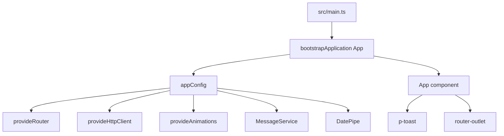
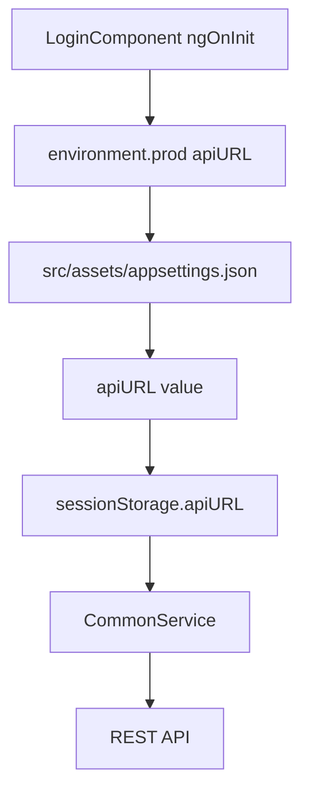
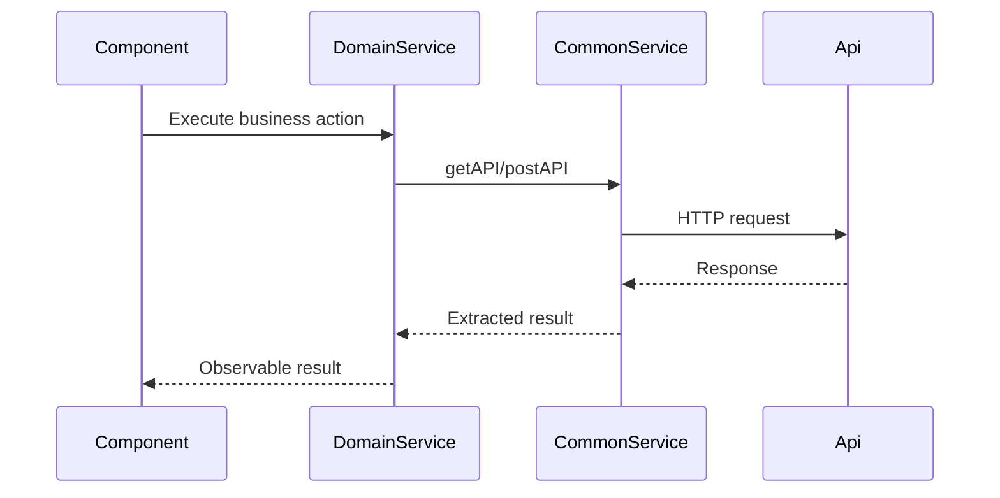
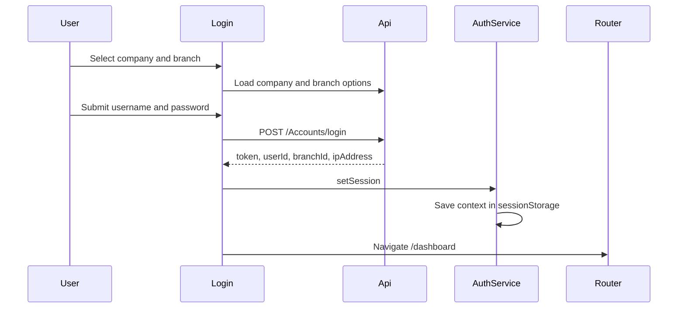
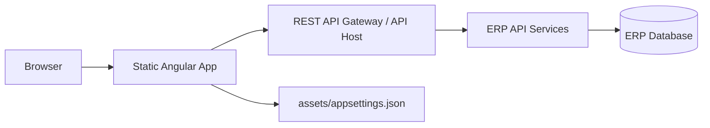

# Technical Architecture Document

Document date: 14-May-2026  
Project: Global ERP V21  
Scope: Frontend, backend integration, database interface, API, deployment, and technical controls  
Source: Angular frontend codebase

## 1. Purpose

This document describes the technical architecture of the Global ERP application. It focuses on how the system is built, how modules are loaded, how API calls are made, how runtime configuration works, and what deployment/build settings are currently visible.

Backend and database source code are not present in this workspace. Backend and database sections therefore describe frontend integration points and recommended architecture details to validate with backend teams.

## 2. Technology Stack

| Layer | Technology |
| --- | --- |
| Frontend framework | Angular 21.2.x |
| Language | TypeScript 5.9.x |
| Application model | Standalone components with lazy route files |
| Routing | `@angular/router` |
| State utilities | Angular signals, RxJS BehaviorSubject, Observables |
| HTTP | Angular HttpClient |
| UI libraries | PrimeNG, PrimeIcons, ng-select, ngx-bootstrap, Bootstrap |
| Notifications | PrimeNG MessageService and Toast |
| PDF generation | jsPDF, jspdf-autotable |
| Excel generation | xlsx, file-saver |
| Build | Angular CLI / `@angular/build` |
| Tests | Angular unit test builder, Vitest, existing `.spec.ts` files |

## 3. Application Structure

| Path | Responsibility |
| --- | --- |
| `src/main.ts` | Angular bootstrap entry point. |
| `src/app/app.config.ts` | Application providers. |
| `src/app/app.routes.ts` | Root route tree. |
| `src/app/app.ts` | Root component, router outlet, toast host, global UI behavior. |
| `src/app/core` | Guards, directives, interceptors, models, and domain services. |
| `src/app/shared` | Shared layout, login, contacts, dashboard, SOS, reference tray, voice assistant, pipes. |
| `src/app/features/accounts` | Accounts feature screens and route file. |
| `src/app/features/inventory` | Inventory screens, route file, screen shell, and report registry. |
| `src/app/features/HRMS` | HRMS payroll and report screens. |
| `src/app/features/settings` | Settings dashboard and route file. |
| `src/assets/appsettings.json` | Runtime API host configuration. |
| `src/envir` | Environment constants. |
| `src/styles.scss` | Global theme and ERP UI styles. |

## 4. Runtime Bootstrap



Application providers:

- `provideRouter(routes)`
- `provideHttpClient()`
- `provideAnimations()`
- `MessageService`
- `DatePipe`
- `provideBrowserGlobalErrorListeners()`

Technical note: `src/app/core/Interceptor/Interceptor.ts` defines `responseInterceptor`, but it is not registered in `provideHttpClient()`.

## 5. Frontend Architecture

### 5.1 Route Layers

```text
/login
/dashboard
  /contacts
  /sos-dashboard
  /accounts
  /inventory
  /hrms
  /settings
/general-receipt/:id
/payment-voucher/:id
/journal-voucher/:id
```

Root route protection:

| Route area | Guard |
| --- | --- |
| `/login` | `guestGuard` |
| `/dashboard` and child modules | `authGuard` |
| Printable voucher routes | `authGuard` |

Feature route files:

| Module | Route file |
| --- | --- |
| Accounts | `src/app/features/accounts/accounts_routs.ts` |
| Inventory | `src/app/features/inventory/inventory_routs.ts` |
| HRMS | `src/app/features/HRMS/hrms_routs.ts` |
| Settings | `src/app/features/settings/settings_routs.ts` |

### 5.2 Layout Layer

The authenticated application layout is hosted by `MainLayoutComponent`.

Responsibilities:

- Loads module metadata from `NavigationService`.
- Tracks selected module, sub-module, and screen.
- Restores breadcrumb state from URL.
- Hosts module tabs, sidebar, mega menu, avatar menu, recent forms, theme selector, SOS help, voice assistant, and reference data tray.
- Persists theme and sidebar state in `localStorage`.

### 5.3 State Management

| State | Implementation |
| --- | --- |
| Authentication state | `AuthService` uses `BehaviorSubject<boolean>` and session storage token. |
| Login form state | Angular signals in `LoginComponent`. |
| Navigation state | `NavigationService` uses BehaviorSubjects. |
| Inventory UI state | Angular signals in `InventoryScreenShell`. |
| User context | `sessionStorage` keys. |
| UI preference | `localStorage` keys. |

### 5.4 Shared UI Behavior

The root `App` component adds cross-cutting UI behavior:

- Adds browser titles to dropdown labels.
- Rewrites generic select placeholders from nearby labels.
- Adds ARIA labels for native selects.
- Enables draggable modal headers for configured modal types.
- Hosts global `p-toast`.

## 6. Backend Integration Architecture

### 6.1 API Host Resolution



Current runtime API configuration:

| Item | Value |
| --- | --- |
| Runtime file | `src/assets/appsettings.json` |
| Key | `apiURL` |
| Current value | `https://globalacc-api.kapilit.com/api` |
| Session key | `apiURL` |

Environment note:

- `src/envir/environment.ts` uses `apiUrl`.
- `src/envir/environment.prod.ts` uses `apiURL`.
- `LoginComponent` imports `environment.prod` directly.

Recommendation: standardize the key name and avoid importing production environment directly from app code.

### 6.2 API Client Pattern

Most domain services call `CommonService`, which builds the full URL and wraps HTTP calls.



Important service files:

| File | Responsibility |
| --- | --- |
| `core/services/Common/common.service.ts` | Shared API facade, formatting, PDF/Excel, notifications, context helpers. |
| `core/services/accounts/accounts-transactions.ts` | Accounts transaction endpoints. |
| `core/services/accounts/accounts-reports.ts` | Accounts report endpoints and report helpers. |
| `core/services/accounts/accounts-config.ts` | Accounts configuration endpoints. |
| `core/services/hrms/hrms-payroll.ts` | HRMS payroll endpoints and PDF helpers. |
| `core/services/Login/login.service.ts` | Login and user rights endpoints. |
| `core/services/Navigation/navigation.service.ts` | Navigation metadata plus dashboard/user-right endpoints. |
| `shared/sos-help/sos-ticket.service.ts` | Support ticket creation and local fallback storage. |

### 6.3 API Endpoint Families

| Family | Examples |
| --- | --- |
| Login | `/Accounts/login`, `/Accounts/GetUsersCompanyCodes`, `/Accounts/GetUsersBranchCodes` |
| Accounts transactions | `/Accounts/savegeneralreceipt`, `/Accounts/SavePaymentVoucher`, `/Accounts/SaveJournalVoucher` |
| Accounts configuration | `/Accounts/SaveBankInformation`, `/Accounts/SaveChequeManagement`, `/Accounts/SaveCompanyConfiguration` |
| Accounts reports | `/Accounts/GetTrialBalance`, `/Accounts/GetAccountLedgerDetails`, `/Accounts/getGstReport1` |
| Banking and cheque | `/Accounts/GetChequesOnHandData`, `/Accounts/GetChequesInBankData`, `/Accounts/GetBrsReportBankDebitsBankCredits` |
| HRMS | `/HRMSTransactions/GetCalendarYear`, `/HRMSTransactions/SaveJVDetails` |
| Settings | `/Settings/Users/UserRights/GetUserForms`, `/Settings/Users/UserRights/GetUserRightsBasedonRoleAnduserId` |
| Dashboard | `/Dashboard/getUnclearedChequesNotification`, `/Dashboard/getSubscriberBalanceNotificationDiffData` |
| Common | `/Common/GetDesignations`, `/Common/GetApplicationVersiono` |
| Support | `/Support/CreateSosTicket` through CommonService when API base is available |

## 7. Authentication and Authorization

### 7.1 Authentication Flow



### 7.2 Session Keys

| Key | Purpose |
| --- | --- |
| `token` | Login token. |
| `isLoggedIn` | Login flag. |
| `username` | Current user display/name value. |
| `companyCode` | Selected company code. |
| `branchCode` | Selected branch code. |
| `branchId` | Selected branch ID. |
| `userId` | Current user ID. |
| `ipAddress` | Login response IP address. |
| `loggedInUser` | JSON user context. |
| `CompanyDetails` | Company detail object for reports and headers. |
| `apiURL` | Runtime API base URL. |

Technical security notes:

- The token is stored in `sessionStorage`.
- `authGuard` only checks token existence.
- No active registered interceptor was found for adding Authorization headers.
- User-rights APIs are referenced, but frontend route-level role enforcement is not fully visible.

## 8. Database Interface From Frontend

Frontend API calls repeatedly include:

- `GlobalSchema`
- `BranchSchema`
- `TaxesSchema` or `TaxSchema`
- `CompanyCode`
- `BranchCode`
- `branchId`
- `userId`

This implies a multi-company, multi-branch tenant model where each transaction is scoped to selected company and branch, and sometimes to a backend schema.

Backend/database validation required:

- Confirm physical schema names and tenant mapping.
- Confirm whether branch schema is a real database schema or logical partition key.
- Confirm transaction posting and reversal rules.
- Confirm report sources: tables, views, or stored procedures.

## 9. Reporting and Export

| Area | Implementation |
| --- | --- |
| Accounts | Report components use AccountsReports and CommonService PDF helpers. |
| HRMS | `HrmsReportShell` renders config-based forms and supports print/PDF/Excel. |
| Inventory | `inventory-report.registry.ts` defines report metadata consumed by report pages. |
| PDF | jsPDF and jspdf-autotable. |
| Excel | xlsx and file-saver. |
| Print | Browser print and generated PDF iframe flows. |

## 10. Deployment and Build

Package scripts:

| Command | Purpose |
| --- | --- |
| `npm start` | Run local Angular dev server. |
| `npm run build` | Production build. |
| `npm run watch` | Development build in watch mode. |
| `npm test` | Unit tests. |

Angular build settings:

| Item | Setting |
| --- | --- |
| Builder | `@angular/build:application` |
| Browser entry | `src/main.ts` |
| Index | `src/index.html` |
| Assets | `src/assets`, `public` |
| Global styles | ng-select CSS, Bootstrap CSS, `src/styles.scss` |
| Default configuration | production |
| Production output hashing | enabled |
| Initial budget warning | 2 MB |
| Initial budget error | 3 MB |
| Component style warning | 24 kB |
| Component style error | 32 kB |

Recommended deployment model:



Deployment requirements to document with infrastructure team:

- Hosting location for Angular static files.
- API base URL per environment.
- TLS certificate ownership.
- Cache policy for `assets/appsettings.json`.
- CDN or reverse proxy rules.
- Error logging and monitoring.
- Build artifact promotion process.

## 11. Technical Risks and Recommendations

| Area | Observation | Recommendation |
| --- | --- | --- |
| Interceptor | `responseInterceptor` exists but is not registered. | Register or remove it. Add auth interceptor if bearer token is required. |
| CommonService | Handles too many responsibilities. | Split into API client, export, notification, formatting, and tenant context services. |
| Environment keys | `apiUrl` and `apiURL` are inconsistent. | Standardize environment contract. |
| API URL storage | API base is stored in session storage after login page load. | Add fallback loading for direct deep links into authenticated routes. |
| Hardcoded API URL | Some files reference `https://localhost:5001/api`. | Move all API bases to runtime config. |
| User rights | Route-level role checks are not complete in frontend. | Apply rights from backend to menu, route, and action buttons. |
| Types | Many services use `any`. | Add typed request/response DTOs for core documents. |
| Settings | Navigation includes more screens than routes. | Align menu and route implementation. |

